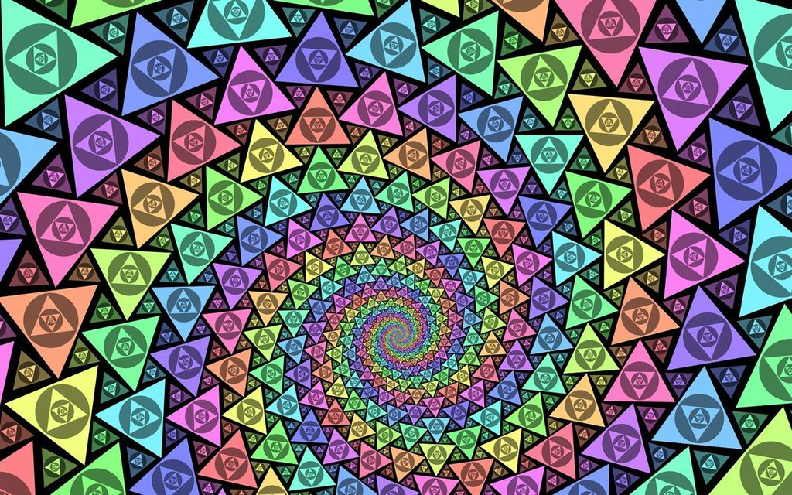
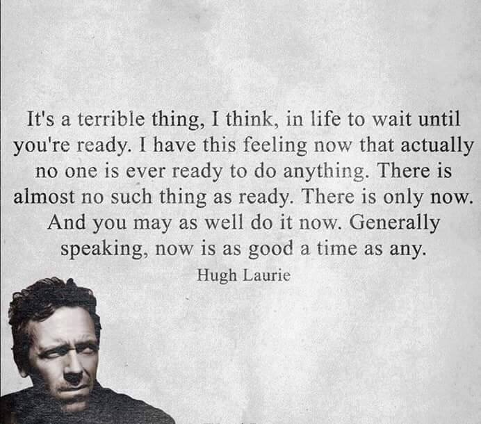
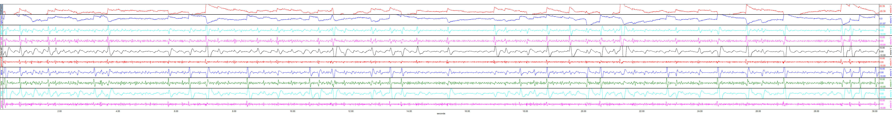
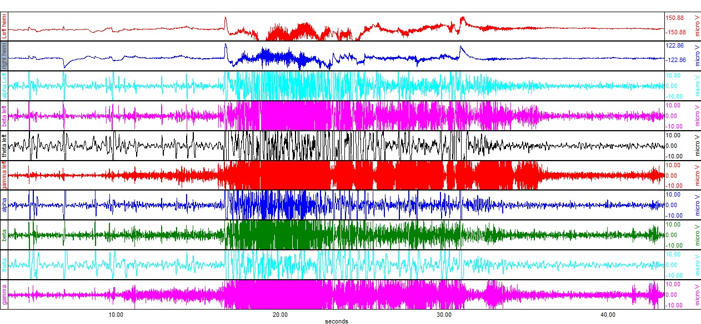

[](documentation.md)

# DMT





There is likely nothing you can experience in normal reality that can prepare you for something this intense. There is much more to life and to consciousness than we know.

# contacts

- [Dr. Robin Carhart-Harris](https://www.imperial.ac.uk/people/r.carhart-harris)

# references

- [Algorithmic Reduction of Psychedelic States](https://qualiacomputing.com/2016/06/20/algorithmic-reduction-of-psychedelic-states)
- [The Hyperbolic Geometry of DMT Experiences: Symmetries, Sheets, and Saddled Scenes](https://qualiacomputing.com/2016/12/12/the-hyperbolic-geometry-of-dmt-experiences)
- [A Model for the Application of Target-Controlled Intravenous Infusion for a Prolonged Immersive DMT Psychedelic Experience](fphar-07-00211.pdf)
- [DMT Research from 1956 to the Edge of Time](dmt_research_1956_edge_time_arg_dpl_final.pdf)
- [Effects of a Psychedelic, Tropical Tea, Ayahuasca, on the Electroencephalographic (EEG) Activity of the Human Brain During a Shamanistic Ritual](11125hof.pdf)
- [The Psychedelic State Induced by Ayahuasca Modulates the Activity and Connectivity of the Default Mode Network](journal.pone.0118143.pdf)
- [Moving into the Sacred World of DMT -- ∞Ayes](Moving_into_the_Sacred_World_of_DMT.pdf)
- [Just a Wee Bit More About DMT -- ∞Ayes](Just_a_Wee_Bit_More_About_DMT.pdf)
- [A Physician's Attempt to Self-Medicate Bipolar Depression with N,N-Dumethyltryptamine (DMT)](A_Physician’s_Attempt_to_Self_Medicate_Bipolar_Depression_with_N,N-Dimethyltryptamine_(DMT).pdf)

# purchase

- [multiexciter](http://pwoah7foa6au2pul.onion/user.php?id=multiexciter) (organically grown Mimosa Hostilis using improved STB method)

# make

[](https://www.youtube.com/embed/gdEwyfH_QMs)

# reports

## [2013-02-10T205010Z drpsychedelic](https://www.reddit.com/r/Drugs/comments/1897hs/eeg_of_dmt)

According to the report (which is possibly not rigorous), a normal human brain oscillates 8--30 Hz. While on DMR, the frontal cortex reaches over 2500 Hz (which was the Nyquist frequency with a sample rate of 5000 s-1). The high frequencies may be reminiscent of seizures. DMT induces a massive release of Ca2+ also. In a sense, DMT overclocks the brain or "induces an electrical shit storm".

EEG baseline:



EEG DMT:



- [raw data](http://www.mediafire.com/file/abwdbcfzzy41mbm/eeg+raw+data.xlsx)

## Erowid 86874

- [exp-86874.pdf](DMT/exp-86874.pdf)

# get

## MrPBateman

- [Dream account](http://t3e6ly3uoif4zcw2.onion/contactMember?member=MrPBateman)
- ["[XX] 1g High quality NN-DMT"](http://t3e6ly3uoif4zcw2.onion/viewProduct?offer=447742.335684)

contact details:

- <MrPBateman@secmail.pro>

PGP:

```
-----BEGIN PGP PUBLIC KEY BLOCK-----

mQINBFl4bvQBEAC0mhDc1ab5qiihAzyqkmTZ9SCnSNGMH7pHoEooV1szDbLAdlQL
sZjjLpxafnPzaRYS9Qyjm49jiKUqkY1vdaXfPgituwjcQP04Y/JkUVR5fVDAviRd
Ig6ictJbDY8cd3CcLbUVlH01/aoaCwfayuKK3M0mRMrolTHK9hy4FPGJPYqObuor
VYwaZuTtjaW9oQhP9y1Aq+SM8R4QhIJWPBDKTXIg0f4BdwndAe31CHpriq6xB8Af
+wKeGwMjlb8BFS52vORZCAg+mNh955SFb24+4To28kOuHl9g2Nalz6FVMOWMeDdt
gRnLSU+aEnrsQUAFy1OWMDSLrKZ0sWOUhTZkllVnoFkpa1S6pLgMaofiCJAdls/2
tJOwfv3vhC/upvSj5oyTCBJz9eJXVWk6jmWJEdKzpQu+RyB+bpd7olpehde3119i
9Y5yZ+At/Wus1PTIddquBeGDiWTXMuP16UKtL4x6D7bTczKa8py7AlB6aZJ8tJVH
2xAbaAqda5+RB6HXlztX0wa6Ip9kWQG9fhGEXL1ToxPQb2nktbQkPwVUSKZ50FIT
XnvEO4VxszvIblqblo1zr/5KfXmkJieOwl/XmiE0uCZLWPngeNOZ0UikAsu6Ktye
LDCM9hrQ41j9GJ5YW5mp1HgGOKXVNUy7MzWCaXy1BmCra6uM8/onB1MLWQARAQAB
tCJNclBCYXRlbWFuIDxNclBCYXRlbWFuQE1hcmtldC5jb20+iQJOBBMBCgA4FiEE
+CnPH3J7ORiHt4/YalJ03LW769QFAll4bvQCGwMFCwkIBwMFFQoJCAsFFgIDAQAC
HgECF4AACgkQalJ03LW769SI8A//XAUbsXlEi1acw7GmL6zjpBSGxtWvqSzkS+xQ
wFDCKYBNGlPBouedOW9+hLxklI8xJVvUQdaVt4fjMokVMIqOQ6qa1hj72t4bCMQu
QruzYoeGCKSFDbQ+y7w3eEvLXRJ2QNijDavSc1BGDKvFEZxfDrkYr2I8h26zwHHl
J3KrosT0rdSH24UTStuBrBHLsovETPHPQZ5pK4+EAPP5V3fsCj/ryTuFbyjMcMxI
FiN649SHk2LDS/2SiG+3XXY2C2snXBsbcuzer6aHfAhT3Zi16PyIoNDmNFZ92kb7
b563vA2AN3xx5c/Ck3BLibtiM2aongtC2MYT9rVlhnP+sqSjvsVz0tGsa1cp2BJN
lWvg9HLx/M5R4WiWfJFFP+DFdz0ZQPQxmUnprJqu4W7CAa6pCmPSBgvneOnT2FnM
DErHNRjUY4XZBwmzp87mFFgaaMTlsj4t+zHdxBl6j+0SKgF2HhMxn/xvd/NPoMMM
SaTK/pph/GRHSepN0Jlf3kJWriw4+M6F4Pio1NC8kWdo3A5hoObkxn4QXTjI5Yw/
2NuovhDoJD6KhTdn7dOyvzGWstVyGVnhDlgZ1x8CCeV+y09smCuifyCGOmdKyEeI
Q7IIu+uqZ49MIvgxiIFNbdo0SF4OTrQ2h+/tDpLCEYNMygUetFoY9avbGF/k/4u+
TN0WG2u5Ag0EWXhu9AEQAN4/VGfHmW/nkIcWNOh+x20WOBED90Eyyw6iWYvq53f8
JEYW4EMMife783lSWqfmBFyhmmfesw/6kLz4ontLLShKZjTngb1pp7+Gb61oF8xc
be+7BB1gcbYsZ6XX7YtzQVJBj91F5jsBzxfxx8hz90RP+d4oFR+rcHTVUkZ2faZl
9XEYTt5PozN/lBmx0B3FY3Tw3qhtZnC8pMj01j4JCAfY8STdMrpqnpqYZY/g+Sny
avPoe/mnZVRkGuYMe6n/qH2IJUKjVAgabk+lWDiChn6fFODHn4P3LJo+K6MG8CyQ
eV2XI0PEjW8JwB1nzMZiExoHRgl7N1Xt3Oc/+306btxsTja5kESSRhRwTXLmyjaN
U+juYYDen1KnLKKgicSC3OyzgDipValmAltrUASj52Vzw4p0MtUeBpR2qo8F/PZr
bsQ1/xVBe+4An4sgyIXvWqScp6ZVmgnmSYRXc3OuqlWaj415RwADBAuLTqOae/Tf
cUGbG26OQUhzUfFAKAdkF38boE7FqbaHUIUSzKAQibgVuDF0dMnyOsY4AAsDIdQt
3AQzIjKCdmSG4b8q7ypOnYJfkQOAGOF0HPcv9bIUb/nzswvUqZYOMPbTI2UXag3E
Bh8eEV1DhIywycWIhptiyXV+CYnV/HRJ68ClVp3wcrs37n0Jn6aDgI3L6HvWar3H
ABEBAAGJAjYEGAEKACAWIQT4Kc8fcns5GIe3j9hqUnTctbvr1AUCWXhu9AIbDAAK
CRBqUnTctbvr1AwLEACeP4dV4l91LdSH71he3oz+elBaHkXyZkqUlyDmNUPjKpfW
H2NAEUDCYMqM8GzHmkfBtubVmXvfDUsqTBnWqoIcD6kVMg2JHt6UDQMZhiZU74J6
kw2ojgolpdEQglOS7fPS89QQgM2PFeCTxeq2AsSkj49roJX2wGpwqfKWMIGljCsy
5sXI/ujhNp4n7tlWu4nj4G6EAvtZDgF/p+7O6fjWs6jj4UmNvGy9AkbAcaiG5vfX
uJGXvTm9lIDxBJyUmEV6SP1PhM+ylUvezu7QcrLH9vxCu/WnlgjUVZ+MGauguc/c
XMiHWdXISayGA8QSnFH5t9kl8oExVGhR+eQctvubD2KFEkLqtZTqAXTXqopxF+k5
tP5/mYZHXR84fFoj181dUYAntanKIbxA7Fe6yE7f2yUBnOYTTI6NF8gwycRKu7cV
E1xuoQda7ZAbhz8Pnny7mjb96xDVYAp0yBM+V7pvjwnvTWKMerJSX4/AW8W+Qa69
zwDWADFGr/UDwoqpy6inS3aE64nIhogyhlgTatBfD3RnjvPMO6regAs4QzSH9s14
g2J+kbvUpBvXbUFe/bIz4ZSbBr/Ula/4sErs/V9YN7ZRw9DSAYcwVSD9hLHO13/P
VeKhmXBas59O+ZpY4Ij2XhG9oQy3Nxjxltf+tUF5Kk5KJsXwucu+9frAHBjTdA==
=Lx/f
-----END PGP PUBLIC KEY BLOCK-----
```
