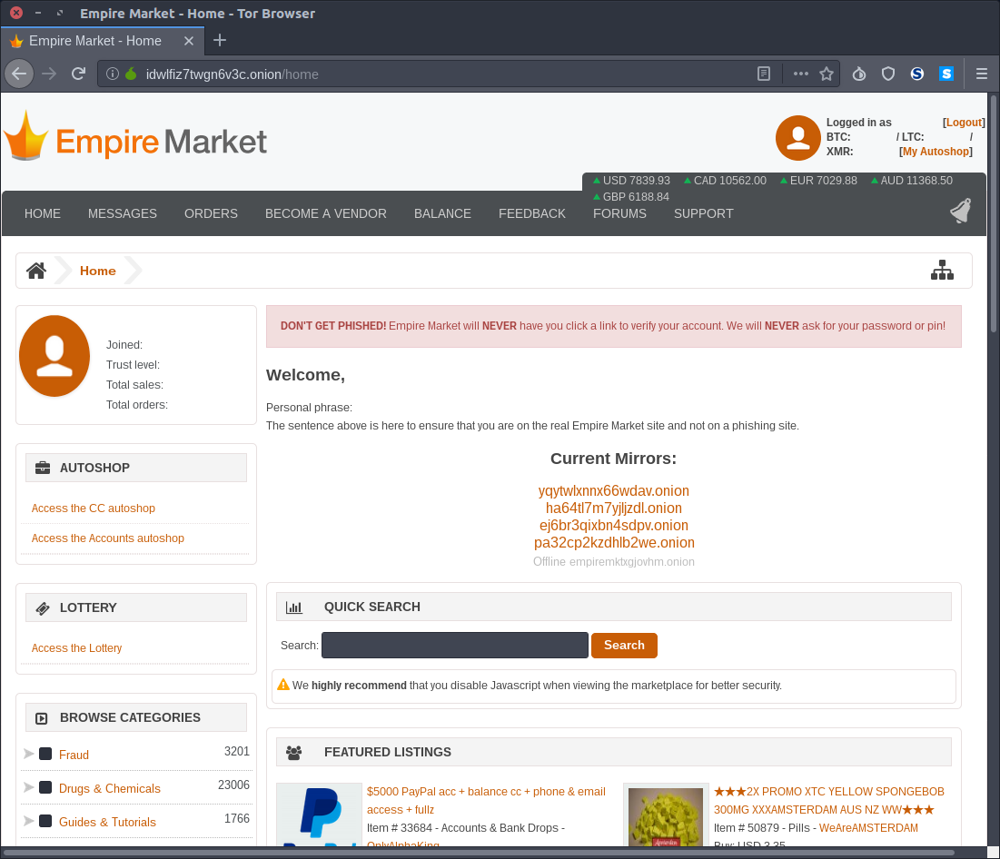
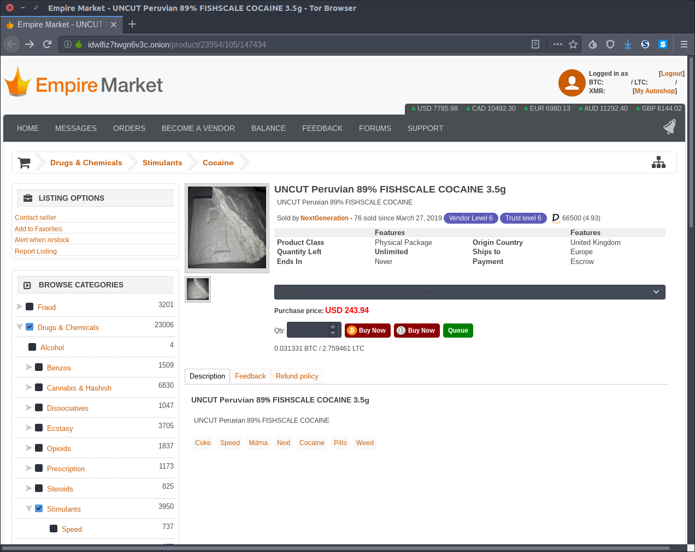

[](documentation.md)

# Empire Market






# comments

This market uses [Bitcoin](Bitcoin.md), Litecoin and [Monero](Monero.md). Monero offers the best privacy, so it is recommended.

# links

- dark.fail
    - darkfailllnkf4vf.onion
    - https://darkfail.me
    - https://mastodon.social/@darkdotfail
    - https://twitter.com/darkdotfail
- (possibly now compromised) possible source, may be dodgy: <https://dark.fail/empire> (more extensive listing showing history: <https://dark.fail/captcha/empire>)
    - zs7qclvuwl4srczf.onion
    - inqosyzepcx7776u.onion
    - 3b6mdxuw4r5gwj7e.onion
    - empiremktxgjovhm.onion
    - xc6jxjvxxinlvszj.onion

## links origin hierarchy

- 2019-12-09T1757Z http://ulkt55mrvzqh3zsm.onion (dark.fail) (GPG verified)
    - wikpklptg7or6mun.onion
    - dmqkb5e3dxmwa4dh.onion
    - g6qwwjtjzzqgyfej.onion
    - feykdoz3wtnbmprt.onion 
- 2019-12-09T1626Z http://v6u2ngtpiihou77b.onion (dark.fail) (GPG verified)
    - l4mnkhs3nc3pwwqv.onion
    - dtcvvnpq3x3kg7ng.onion
    - 6hbocssf2vcrwb7q.onion
    - lu5i4uudgaq5i6vw.onion
    - lu5i4uudgaq5i6vw.onion
    - z5yry3xoktbvvrec.onion
    - 2iz3wts7pptori3h.onion
    - ybwin5cmj4hi5ynt.onion 
- 2019-11-27T1753Z ir27si6mhsfrlivf.onion (darkfailllnkf4vf.onion) (GPG verified)
    - hn3bzy73jkyupdb7.onion
    - yq2gubfubcukxulx.onion 
- 2019-11-27T1726Z ofpu3572gurhjtus.onion (darkfailllnkf4vf.onion) (GPG not verified?)
- 2019-11-27T1410Z r3p3c3nh4ayo7xgc.onion (darkfailllnkf4vf.onion) (GPG verified)
    - 6j2isf75s7fzkm57.onion
    - wqjnn3scdysbnu2f.onion
    - xe6qptln26lzp447.onion
- 2019-10-28T1626Z alu4z7a3upjtlqva.onion (from earlier verified EM)
    - wnsqqi2vyh5mem7u.onion
    - qwqyw34d7eytinoc.onion
    - cyffrxf77xph3woj.onion
    - burdhzujb6rmw4o3.onion 
    - 2s7aew6jmyrw56fh.onion
    - 3eq4ocmws6fbq56k.onion 
    - eptvopdw65lahlrn.onion
    - tegl2myysau7a5c5.onion
    - ysxtvjtv22tfgrbx.onion 
- 2019-10-28T1456Z dark.fail
    - http://ipvbmqgc2wwmocba.onion (2019-10-28T1535Z GPG verified)
    - http://zy5w7pf3qmhc44eu.onion
    - http://7g2kcbywm6ysaszn.onion
    - http://25j4vktihdh4htnf.onion (2019-10-28T1538Z GPG verified)
        - clchhrs2gdobpzsi.onion
        - ssdeffjcmtd7pk4o.onion
        - epb2jet7rlha3rns.onion 
    - http://zy5w7pf3qmhc44eu.onion (2019-10-28T1614Z GPG verified)
- 2019-09-08T1957Z dark.fail
    - http://xkeeuyoofb3fpzut.onion (2019-09-08T1957Z PGP verified)
- 2019-08-30T2152Z dark.fail
    - http://o77fogw5sonryuvp.onion
    - http://gg5pdwlspwhpuvib.onion
    - http://glbfviigvxhtyixk.onion
    - http://3pj6pwam3piwrzoo.onion
- 2019-08-30T2103Z dark.fail
    - http://yixaenukfxc6yw4l.onion
    - http://o77fogw5sonryuvp.onion
    - http://3mywxi5ctiahtj75.onion
    - http://5h2csvvbrksbrcrn.onion (2019-08-30T2106Z PGP verified)
http://gg5pdwlspwhpuvib.onion
- 2019-08-30T0327Z dark.fail
    - http://6jnsxr4itneu5kus.onion
    - http://gbkjcibs7ktpeipl.onion
    - http://ahr5ovbhh6ig3f6p.onion
    - http://datgedjiyvlg5f7o.onion
    - http://vnidcapusidms3m6.onion
    - 2019-08-30T0328Z (PGP verified)
        - http://dxkbx5kb4qcvmlea.onion
        - http://gbb52hpqpwitr55b.onion
- 2019-08-30T0316Z dark fail.
    http://empiremktn5mte5q.onion
    http://x4mifipxbzxlpake.onion
    http://dfwokmijkjrmrimd.onion
    http://cp3uheqa5p7o4o6b.onion
    http://dktw4bkdwawpobs6.onion
    http://yvffqiwvlmgfcbrr.onion
    http://2uhqsr2fhqidhopc.onion
- 2019-08-28T0043Z dark.fail
    - cyib6cse7x5b5v44.onion (2019-08-28T0047Z PGP verified)
- 2019-08-26T2049Z dark.fail
    - http://rrj5h6vfajapouxz.onion (2019-08-26T2051Z PGP verified)
- 2019-08-26T1924Z dark.fail
    - <http://dqepohrmr3ucdwer.onion> (2019-08-26T2003Z PGP verified)
        - 2019-08-26T2005Z
             - u2ysdpzr6vjifmve.onion
             - r355e7xq3doa4gxq.onion (2019-08-26T2047Z PGP verified)
             - 7pw2l3yuthg6tdku.onion
             - rrj5h6vfajapouxz.onion 
- 2019-06-11T1340Z <https://darknetlive.com/darknet-market-list>
    - <http://xc6jxjvxxinlvszj.onion> (2019-06-11T1343Z PGP verified)
        - 2019-06-11T1345Z
            - <http://aiimnk3g3zgyule2.onion>
            - <http://jr5dn6mvy2stjgjk.onion>
            - <http://ndgbko7jczcatuje.onion>
            - <http://qpbsvr374yelq6o6.onion> (2019-06-11T1519Z PGP verified)
                - 2019-06-11T1517Z
                    - <http://aiimnk3g3zgyule2.onion>
                    - <http://jr5dn6mvy2stjgjk.onion>
                    - <http://ndgbko7jczcatuje.onion>
                    - <http://4e2b5azxuhlryml4.onion> 
            - <http://4e2b5azxuhlryml4.onion> 
        - 2019-06-12T0023Z
            - <http://gexufj7vb55jxtk5.onion>
            - <http://mggdtdba6zniud65.onion>
            - <http://p3mm4fnyuqlimdcq.onion>
            - <http://mttzugnjjcmwe6pp.onion>
            - <http://y3zf6zdzzurqmmz5.onion> 
- 2019-06-11T1306Z dark.fail
    - <http://j3hi2zuegerdyb5d.onion>
    - <http://xvvrr52evfqoo7lt.onion>
    - <http://jr5dn6mvy2stjgjk.onion>
    - <http://qpbsvr374yelq6o6.onion>
    - <http://ndgbko7jczcatuje.onion> (2019-06-11T1306Z PGP verified)
        - 2019-06-11T1310Z
            - <http://aiimnk3g3zgyule2.onion>
            - <http://jr5dn6mvy2stjgjk.onion>
            - <http://qpbsvr374yelq6o6.onion>
            - <http://4e2b5azxuhlryml4.onion> 
    - <http://aiimnk3g3zgyule2.onion>
    - <http://5k5h5hzacvq266dk.onion>
    - <http://fiychoic4ksepoca.onion>
    - <http://xlxngx4ocmxxe5cz.onion>
    - <http://wdjpbqndyocafjix.onion>
    - <http://azphpyrmqk7n2dpa.onion>
- 2019-06-11T1231Z dark.fail
    - <http://xvvrr52evfqoo7lt.onion> (likely ok)
        - 2019-06-11T1254Z
            - <http://jr5dn6mvy2stjgjk.onion>
            - <http://ndgbko7jczcatuje.onion>
            - <http://qpbsvr374yelq6o6.onion>
- 2019-06-10T1255Z dark.fail
    - <http://bm23kfme2mqjd5ei.onion>
        - 2019-06-10T1306Z
            - <http://5gljnuap2iy3q36q.onion>
            - <http://7dnucgtlejqsi4oi.onion>
            - <http://stsco4p6lmsgxxyy.onion>
            - <http://i77zwzedbmcoebwb.onion>
    - <http://stsco4p6lmsgxxyy.onion>
    - <http://7dnucgtlejqsi4oi.onion>
    - <http://ejqqnso3k2wxapuy.onion>
    - <http://mr4mzqb2iqtxwcrl.onion>
    - <http://xu4ey5dkp2g4ej7w.onion>
    - <http://5gljnuap2iy3q36q.onion>
- 2019-06-03T1611Z dark.fail
    - <http://45puoqgm3jxfovny.onion>

# Empire Market PGP public key (2019-06-11T1408Z from http://xvvrr52evfqoo7lt.onion and http://xc6jxjvxxinlvszj.onion)

```
-----BEGIN PGP PUBLIC KEY BLOCK-----
Version: GnuPG v2.0.22 (GNU/Linux)

mQINBFoTKj4BEADF8SRTYfFg17I5cYMbIGYBg2nLb8kCOL47vE6k38yUme0Lp42f
FKyoaSCaERFAjFwRKFpS1pRFZRDCFzC4dNGhSGusHpUcdw2WOE2wt+cKcuMjW1JU
asB6jOBw5UsKuHCMcPe6zur/rWvW80ZoijXHABsoiLjagmDRqNxLCGf06vrEfViD
uJchyusaM5WBzcDASBUPc65m0MecaB479kinxYjQWf0btadnuJVhHsv8hRosuC3z
FsHfDEsCB1A6nr0ivHa8gECEI/5mAYdB7fVWin6sig1aganAJmmqqbaveT/s7LvQ
JqQ2HAHLvUkqndQSPtuDboB+8FY2XDLPy+V7zP7McQJVHeUyiycVhsrZJnclZh/Y
/NAF9IcfiOcDYYoHntrU0inWjw6u+72UTtxMLZ4zIYxYVFiijyR855XmEfLz007E
Sk0h4FHojoJCl7wQVuSmxHXB/gLsGb+znDd/z4NMWFUJOVdKtdW76fINvkq4c5lE
7ql8Cq1HkhYaUBvqovBrKvIII+cyFlu87WLGpCm0nQFNi+M5nuZ8U3sH2NJ4Nr9h
Bt4TdW/Qou9FmLFoWiqCXiUvlFMqhxBckaJtxqRV0KV/X7jVfaQpJCcWgJf2jhCy
6HR+8lB8uj9hCykpfLOTlZ61ETSjVJC5t6vHyEQDO/+r4LXhF9Io/ybqrQARAQAB
tCRFbXBpcmVNYXJrZXQgPGVtcGlyZW1hcmtldEBub25lLmNvbT6JAjkEEwECACMF
AloTKj4CGwMHCwkIBwMCAQYVCAIJCgsEFgIDAQIeAQIXgAAKCRCRYCb1bquDHnba
EADDNlgnN1wSBgXXiD4Ju8z9ddab9lBdkspWSxdTUbqnN+uGNZhTgaIMosv6d11X
osqPBiDmaa9+afigf8KsqmqC6f3JzqaLkRug2JaEcHCH/hGBes36skxCF7zxk/Ju
Mmnu/I1mwt4fP/4ebdG2ygWU+MEVFhiy8GYGUQ7X2KOJcDQGP+8Sp4Zl6U/TL/9f
wg+ThXisiHEpOTDAbPDmf6ZJQO0Dl5tQMogpn156+xwlCon3Fhr0ycwkix2EJCzz
sHJaugCdVP8ssUobwsPB4QpEkubsOcfOKig2bxnM4CMYzMfSn7eXVvOM4qg3CGR5
kxha8LVC1ib/O7XJbvKbwxwjrO0/+PWeoLNwgYV40SJeI4jm/xi6hWqPGMObn/xx
+M13WUQA5LwfhUpmbLbplm8rt38BAld++tFTdNneQIPM74LXNUUuEWiKJPcAnx0L
GjWCMwsOOe/2D9178L5BXsLh0Ext9xNU3krp7VeHRtOFlRDOdg6YZbZ3nonLswLG
V9xrcMAYmEKwWNaLZAr/tPq6k8glo9rCfCCN50kG9h77kZi5zdUgHtxZFHUKs/Vs
0HhrdqXK6qGjQ/AijhA0IgPuWbCy9bUtU5iaUeA6z51+vxbda0bMmQwO1dv0JUXI
TeTDcleRszfXwsuiCwviiUloKKa27JuBChQ3vy6iVwBUB7kCDQRaEyo+ARAAsyNM
mlYo8a1qI8qOF2LEq8NoGTHBe8u1N4Q1rlOfIw6mEUgDD9G+QAUPPVcpwjTDdTC0
zzoRkpUbqOMpNJqpCA1xTUJBnuBdyRtq/vEyuVSxc8niji9sbkxj2psn5tu//dfy
2MxNbFP1JnBRQ5dEIj6d5kcZt0+EhwXqmKvKPPhMeVEz4E4fDOZeMqrbmcY4iiTT
qFdN8aJ3E+tJ6pS6HUWwgMOwcQhCzah5q6eMaqtZA7PnuIpeudeVok0i5pvyfDmJ
sB4nqeeJFyzgNsGy5GkN4vI2zX7luYrxzrDIkmTIwCFmPk9PQHiAY0I+OqeUoPiL
HUizvschbKV3TqSYNwlyi5GTymysCKbHvyqGdNgRJxAzV6htDymEBkB5egj98DhM
UxCP9P1lhjEkf6GSJK0Y6cppL1NkjD2VG/BT++SqznQCbey1kuZ1UGFaDOpN1vQv
F5zSG2t7WLmoZU3k7X3ljpZpSBD2EFcac/wQ+6uE9UMiFU1y9AImC/AqC3oIWE8S
gPmG7FULN2pjfQ7wPNqovChtxB3lAqzzzFTX+7UDMiGf8oakxkvwIjQkUL5zEOXn
rTvKLaSy4ehxpcyLvU5GXgMyWMaugp04ff3UeJ680eM+P/zJAt81hggOJNqqMVm5
aiEuY1yBV9TcZF8qRNwX53UtjGg6YQ0wRgqAp2kAEQEAAYkCHwQYAQIACQUCWhMq
PgIbDAAKCRCRYCb1bquDHrKOEACtjY0GUx3wkoDXqLKErhsIwou1MBtQgSZnkrU0
2MLrRgOa2zABIsFSSLRVJez4oNEYpq6s3dt7zZTBR4Xuc1MGQHbfW5LRnwi+oD+X
MqKLYwLPVUlxLdFvF5sl6I+LKRhQTm3CZ56RC2XEyhsBBDSFG6eJGkiV1WHqBBDW
OI6M/hCs05bpyCpMixXzagGv97j7JITNZdS8NbiYU44jbqdTSa6sDvQ/gnPAB9p0
JAZCDmN0uLZ6zr2S7ovDl7O+1YUj8oKNkcnynlzl4CmQ539Js5SzdGaQ98fPIDgU
zDfP6m77+MlmgzDkOxsWfzK87Rw2AsWQTZILc7pZvLoTFHsMsp4nKUOTWj5Aj2PA
zngdH5wkYBTAb3aaVxfdw3HoJ6eKmAnK7fdmP9XBVCZFlJCppw9lc6Jh6/SPcNbr
33rkvO88YTCq5nCwYEGlZ90PwHGGJqzNBW/v+MJf89eithynE74QRReVNuJDwmdd
qg0/+/nuFsfglbRHCAMGpFnYART42aHILnJAd86+9t6m9q3f3fUqR7e93Zl7R8I9
Ol3Mtrgn8/IyiqUvFxHM91BdWMkWRv4jirytBe8+JC49GNEf0hMuBw3IqukiQpC9
2J0mCuRoJwqtH10lk226lRN7RVwTJFnZHXotewzMmmkEc+M8EHofjLLAw9p2VA8C
Y+2Rlg==
=eO6H
-----END PGP PUBLIC KEY BLOCK-----
```

# register and security setup

Access the market using some URL, preferably acquired from within the market itself. Verify the market PGP key by selecting "Verify Mirror".

There are a number of unlabelled fields listed when registering. They are as follows:

- 1: username
- 2: passcode
- 3: passcode confirm
- 4: 6-digit PIN
- 5: blank
- 6: blank
- 7: traditional fiat units
- 8: cryptocurrency units
- 9: captcha

Enter these and register. Then, you are presented with a mnemonic phrase which you should copy and save. Re-enter the mnemonic into the displayed field and proceed. You are now presented with the login page. After login, add your public PGP key and enable 2-factor authentication (2FA) using the security section of the market. In this context, this means decrypting a message at every login. This ensures that even if a cracker or phisher gets your username and passcode they cannot access your account (because your PGP private key shouldn't leave your computer).

# login

Before login, verify the PGP key of the site by selecting "Verify Mirror". This should display a message like the following:

```
-----BEGIN PGP SIGNED MESSAGE-----
Hash: SHA256

This is a PGP signed proof of mirror, signed by the Empire Market server's PGP public key.

		bm23kfme2mqjd5ei.onion

		2019-10-06 22:09:59

		
-----BEGIN PGP SIGNATURE-----

iQIzBAEBCAAdFiEEnRcbLPGM3/4lRTjokWAm9W6rgx4FAlz+VqkACgkQkWAm9W6r
gx6y+A/9HzpiKlV94asqjHYAntU/sma8hiSktB5qR8BOsPOBZtzC+DDp3VOVZ3qd
7gdiDSw3q+ZvV66M3VsxVe8w7MC4U+d8jS31EHnmcj5+g9RWqulJQJe90J2Z1308
aywM79J1ByUfFaLwizzc78TQDdKQEwEMG9X08/j01oafTl7lAXgDrtJDt37OOzuV
Dn/8daCBlUVQakmRIyKR4KolC1v+DQMu3kFwHpPIg544/s15CX0SpIfCib06+GLk
ryuEv/M2owJOk7nIoHwzzU352xyx/66o0xAq+CompwCOAQOtqrwLf7jlofDMVxD0
eljjiVW9VTaHLvY41aMvN+J70GkYDOZQoEe42Ak8wcsLw1QEGZmEPqJTk7kuwR6/
xQNp18aWkUIp8+mmnSipKruwGYg8juOqRfXJiuvRqJEIL7SBDaRIYc/Qp5NZZ5ND
ifl8tPiO/9YalyvVPCIFxh347kANEu9w7Kdf4BuVoaxfl2/pdqhz6LqPeNnsCBRR
BO9kA7qZVmANrZy/u3REsjnFFC2XQAmTs9XXUlSECWLtTsm/bvWJRkJFbjJ/1vRT
FGmguFRFKsZbx9Z2ECWQHdZtEwzklMAuqS4ZiHoSXncglFXziQxQ0PrDiVZRTNMD
fTdPrimFNu5gbBrpwiiPmgXQuGoxj9vLN4jisA4sJ2BNZrly48o=
=08pH
-----END PGP SIGNATURE-----
```

Ensure that the Empire Market PGP public key is imported:

```Bash
gpg --import Empire_Market_PGP_public_key.asc
```

Then, save the signed message to a file and verify the signature:

```Bash
gpg --verify signature.asc
```

There are a number of unlabelled fields not listed when logging in. They are as follows:

- 1: username
- 2: passcode
- 3: captcha

# deposit

On the deposit page, the site can generate a PGP-signed message featuring the generated deposit address.
