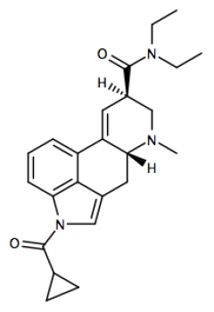
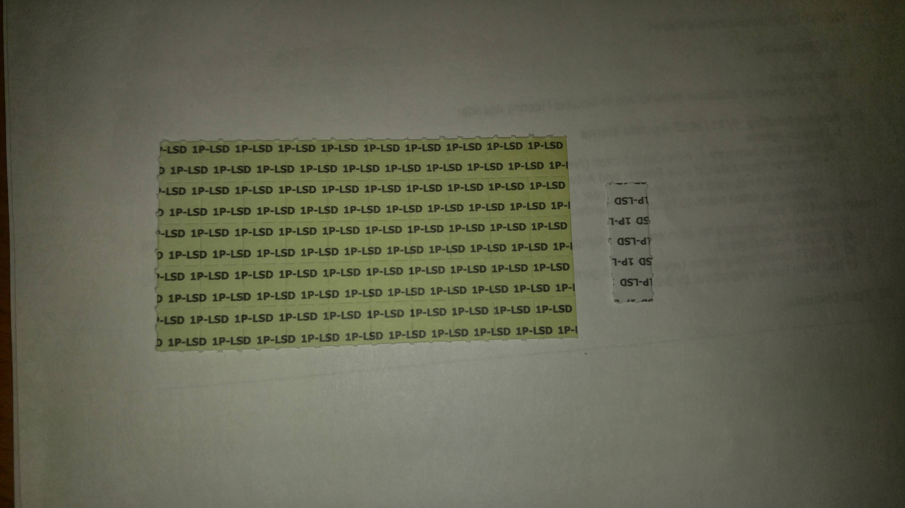

[](documentation.md)

# LSD/1P-LSD/1cP-LSD

"LSD is a drug that occasionally causes psychotic behaviour in persons that have not taken it."


## introduction

Albert Hoffman invented LSD in 1938 while working at the Swiss pharmaceutical company Sandoz Laboratories. He was seeking a respiratory stimulant. The first name for LSD was Delysid. By 1965, more than 2000 LSD articles were published in medical journals and more than 40,000 patients were given Delysid.

It likely activates serotonin 2A receptors. These are located on cells in the frontal cortex, which is involved in the computations that help us to visualise and interpret reality around us. The LSD chemical structure is similar to that of serotonin and fits well into the serotonin receptors, stimulating their activity. 

Psychedelics overstimulate serotonin receptors in the cortex and deep brain structures. In this experience, everything can seem new. The locus coeruleus is a sort of novelty detector. When something novel is experienced, the cells of the locus coeruleus start firing very quickly. Psychedelics amplify the burst firing.

There is a non-psychedelic version of LSD called 2-bromo lysergic acid diethylamide.

Neurotransmitters are chemicals in the brain that help transmit and modulate information. This happens by the chemicals binding to a site, similar to a lock and key, at which the key (neurotransmitter) unlocks a lock (receptor) and this lets the brain know that certain information was exchanged. This information typically releases something known as an action potential, essentially an electrical signal, that lets another part of the brain know that this part of the brain was activated. There are many neurotransmitters and they can do a variety of things in the brain.

LSD has a structure that is very similar to a few neurotransmitters that are produced in the brain. It is most similar to the neurotransmitter serotonin. Serotonin is used to modulate and signal a variety of things in the brain. Visual processing utilizes a lot of serotonin. Almost all of the senses have some serotonin input as well. Emotional processing is also heavily influenced by serotonin.

LSD happens to be even better at activating serotonin receptors than serotonin itself, so it essentially increases the normal levels of signaling by serotonin (it does this through a variety of mechanisms, not just limited to better binding -- it actually releases extra serotonin, changes the lock to accept keys more readily, etc. It is analogous to turning up the volume on quiet music. Not only are the already audible sounds more audible, but things previously inaudible are now audible (whispers that might have been missed, background noise etc.). Because it increases the signal, it also increases the signal noise (if you turn the volume up on a microphone very high, there can be feedback loops or high frequemcy noise). In addition, if the volume is very high, there can be difficulty in discriminating between louder sounds aswell. On LSD, this often results in hallucinations -- hearing, seeing, touching, tasting, etc. things that are not there. In addition, through a relatively unknown mechanism, LSD increases 'cross-talk' between areas of the brain. That is to say, it helps stimulate areas of the brain that don't normally talk to each other, to start talking to each other. Over the long term, it can even help create connections that previously didn't exist -- much like putting up extra telephone or internet lines. This increased cross-talk while under the influence of LSD (combined with the increased sensory input) often results in something known as synesthesia, or a mixing of the senses. What this means is that people might experience a sense across multiple senses -- they might see sound, taste colors, or feel smells.

Since the mechanism of cognition (what causes us to think the way we do) is not known, it is unclear why LSD can change a person's mindset, but it can do this. People often describe LSD experiences as "thinking outside the box". LSD seems to shift the paradaigm of thought. It is likely associated with this 'cross-talk' mechanism, at least to some extent, but the increase in serotonin and dopamine likely has an effect as well. Other serotonergic drugs, such as MDMA (which is very similar to hallucinogens), shift how a person thinks aswell because increased serotonin results in a sort of euphoria (happiness). It also seems to increase a person's ability to empathize with others -- that is to say, one can more easily relate to another's emotional state. This increased empathy also changes how one thinks about things.

No hallucinogens have any proven addictive mechanisms (they are the only recreational drugs that have no addictive qualities). In addition, casual use is not associated with any permanent brain damage. Any use, casual or not, will reduce the relative abundance of serotonin (and other catecholamine receptors, such as dopamine) receptors. However, anecdotal evidence suggests that a single use of a moderate dose can be recovered from within about 1--2 weeks of abstinence.

Psychedelics tend to reduce brain activity in the Default Mode Network (DMN), a network that plausibly manages the "sense of self" and is associated with anxiety, depression and social phobia.

LSD may be an aphrodisiac. It stimulates the pituitary gland to release vasopressin, and vasopressin plays a role in social and sexual behaviour in mammals. Vasopressin and oxytocin are hormones that tend to be involved in sex, intimacy and bonding. In human males, there is a personality shift following orgasm possibly due to antagonism of oxytocin, prolactin release and inhibition of vasopressin secretion.

# references

- [Algorithmic Reduction of Psychedelic States](https://qualiacomputing.com/2016/06/20/algorithmic-reduction-of-psychedelic-states)
- [The Hyperbolic Geometry of DMT Experiences: Symmetries, Sheets, and Saddled Scenes](https://qualiacomputing.com/2016/12/12/the-hyperbolic-geometry-of-dmt-experiences)
- [Neural correlates of the LSD experience revealed by multimodal neuroimaging (2016)](PNAS-2016-Carhart-Harris-4853-8.pdf)
- [How to Safely Use LSD](http://howtousepsychedelics.org/lsd)
- [The Visual Components of a Psychedelic Experience](http://disregardeverythingisay.com/post/9331287956/the-visual-components-of-a-psychedelic-experience)
- [This Calmness I Have Been Craving for So Long](https://www.erowid.org/experiences/exp.php?ID=106975)
- [Neural correlates of the LSD experience revealed by multimodal neuroimaging](PNAS-2016-Carhart-Harris-4853-8.pdf)
- [Return of the lysergamides. Part I: Analytical and behavioural characterization of 1-propionyl-d-lysergic acid diethylamide (1P-LSD)](http://onlinelibrary.wiley.com/doi/10.1002/dta.1884/abstract)
- [Return of the lysergamides. Part I: Analytical
and behavioural characterization of 1-
propionyl-d-lysergic acid diethylamide (1P-LSD) (PDF)](https://a.pomf.cat/blxodi.pdf)
- [Crystal Structure of an LSD-Bound Human Serotonin Receptor (2017-01-26)](PIIS0092867416317494.pdf)
- [The Fabric of Meaning and Subjective Effects in LSD-Induced States Depend on Serotonin 2A Receptor Activation (2017-02-06)](PIIS096098221631510X.pdf)
- [Coma, Hyperthermia and Bleeding Associated with Massive LSD Overdose](westjmed00307-0025.pdf)
- [The Pharmacology of Lysergic Acid Diethylamide: A Review](Passie_et_al-2008-CNS_Neuroscience_Therapeutics.pdf)
- [Psychedelics and Mental Health: A Population Study](journal_pone_0063972.pdf)
- [No link found between psychedelics and psychosis](No_link_found_between_psychedelics_and_psychosis.pdf)
- [Psychedelics not linked to mental health problems or suicidal behavior: A population study](johansen2015.pdf)
- [Classic psychedelic use is associated with reduced psychological distress and suicidality in the United States adult population](hendricks2015.pdf)
- [The Truth About Psychedelic Drugs and Mental Illness](The_Truth_About_Psychedelic_Drugs_and_Mental_Illness.pdf)

---

# 1cP-LSD: Purple Sunshine Acid/Curie Acid (2019--)



- name: 1-cyclopropionyl-lysergic acid diethylamide
- IUPAC: N,N-diethyl-7-methyl-4-cyclopropanoyl-6,6a,8,9-tetrahydroindolo[4,3-fg]quinoline-9-carboxamide
- CAS#: N/A
- molecular mass: N/A
- molecular formula: C23H27N3O2

## get

### BASH Designer Labs

- <https://www.1pLSD.to>
- <https://www.1pLSD.de>
- BASH Limited
- executive: Genevieve Magnan
- address: Global Gateway 8, Rue de la Perle, Providence, Mahé, Seychellen
- Register of International Business Companies: Victoria, Seychelles
- company No: 194692
- Whatsapp Messenger: +49 1577 1507355
- phone: +41 (33) 533 2624

### High Store Research Chemicals Shop

- <http://www.highstore.net/research-chemicals-germany/1cP-LSD>

---

# 1P-LSD: Pink Sunshine Acid (--2019)

## get
### wholesale and manufacturer: [Lizard Labs](https://lizardlabs.eu)

- [Reddit user Lizard-Labs](https://www.reddit.com/user/Lizard-Labs)
- people
- Alex ([reference](https://www.reddit.com/r/RCSources/comments/426ypp/ask_lizardlabs_anything_ive_got_an_awesome))

### reseller: [Research Group Nederland](https://www.researchgroupnederland.com)

- <https://www.researchgroupnederland.com/product/1p-lsd-blotter/>

```
Hurksestraat 64
5652 AL Eindhoven
The Netherlands
Phone:
Email: info@researchgroupnederland.com
KvK: 67881181
Btw (tax): NL198606138B02
```

```
Research Group Nederland
Alex Peijnenburg
Baandervrouwenlaan 145-5,
Baandervrouwenlaan,
5282 BOXTEL,
NL Nederlands, The
```

### reseller: BASH Designer Labs (note: since 2017 it's likely that the German government is monitoring them)

- [1P-LSD Blotter 100 μg](http://www.1plsd.to/1P-LSD-Blotter-100mcg) (2017-07-27T2020Z delays?)
- [coupons!](https://www.reddit.com/r/RCSources/comments/4ts5zb/www1plsdto_coupon_10)


#### 2017-08-16T1727 part of e-mail

```
Hi,

we hereby inform you that 1P-LSD will be available from August 21, 2017. Shipping will be continued from that date.

Furthermore, it is possible for us now to perform promised refunds of outstanding payments we received.

Reasons for temporarily downtime of our service:

Associated with restructurisation of our company (legal form) and already performed relocation (warehouse seperated for shipping from four instead of just one EU state) we have been requested by authorities to furnish evidence that products we provide do not contain prohibited substances.

Precautionary authorities put the formerly used bank account out of operation until all necessary analysis has been obtained.

In absence of of possibility to enter our bank account and misleading communication with authorities in regards of concrete dates for release of our service and customers funds, this kind of communication was devolved on ouf customers.

By having time consuming consulting with a team of lawyers we engaged and responsible authorities it was confirmed that 1p-LSD, 1A-LSD (ALD-52), AL-LAD and ETH-LAD neither are covered by german narcotics law (BtmG)nor, by other german legal acts.

Counter-measures by BASH:

As of the time-dispatched initiation of regulatory actions, outstanding debts to our supplier Lizardlabs (www.lizardlabs.eu) have been provided in time. First refunds had been provided to customers in that period, as well.

As requested by authorities we engaged a internationally well-known lab (specialisation: Drug Checking) for analysis. Our supplier provided them a sample from his stock so that from now on we can continue trade from this stock. To eliminate further interference such analysis will be repeated weekly.

Furthermore, we engaged a third party payments company to manage all incoming payments, as this method (just in case) prevents delays caused by closure of single bank accounts.

Consequently, all promised outstanding refunds can be provided from now on. We ask you for patience, as it is about 500 outstanding payments which are reviewed one by one. This process will take up to 10 days. Please be prepared as we might contact you to receive further information in regard of your payment.
```

### untested

- [Lysergi](https://lysergi.com)
- [Causing Color](https://www.causingcolor.com)
- [Buckled](http://www.buckled.eu)
- [Chem](https://www.chem.eu)
- [DUTCHLABS.EU](https://dutchlabs.eu) (formerly nilo24.de)
- [The Indole Shop](http://theindoleshop.com)
- [VChems](https://vchems.com) (insecure?)
    - discount code?: JUNE2016
    - [reliability](https://www.reddit.com/r/RCSources/comments/4q5jmh/vchemscom_reliability)

### obsolete

- [RoyalAlchemist](https://www.royalalchemist.com)


## chemistry

It is plausible that storing 1P-LSD in a cool, dark place is best for its longevity. 1P-LSD should change to LSD by hydrolysis in the presence of water and in the absence of light.

- UV exposure
    - LizardLabs left some 1P-LSD powder on a piece of card open in an office environment for 2 weeks. It changed in color from white to canary yellow. LCMS analysis suggested that there was negligible degradation, with >99% 1P-LSD and no peak for LSD. The appearance changed but nothing strange happens on analysis.
        - [reference](https://www.reddit.com/r/researchchemicals/comments/34prce/1plsd_tabs_became_yellow_possible_oxidation/cqz7yej)
- dose
    - volumetric microdose (reliable but possibly wasteful)
        - Dilute 150 μg 1P-LSD in 150 ml of water and dose up to 20 μg.
    - microdose by paper
        - Cut the tab into 10 equal pieces or 5 equal pieces. Consume as appropriate.



---

# reports

- "I've never experienced anything like what happened there. It was a little bit like this one time where I sat down and meditated while tripping on acid. All of a sudden I realized I knew exactly how to just disconnect from body, as it just floated away into the void of thoughts, impressions and everything else bouncing around in my head."

- "First time I tripped on lsd, it was a bad trip. Not horrible, just really depressing. The second time I took it, it was pretty much the exact opposite, non stop happiness After the first trip, waking up sober the next day, I felt indestructible. Compared to my bad trip, nothing else was really that hard After the second trip, I was put into such a good mood, nothing else could hurt me. Just wanted to share, and for anyone wanting to avoid a bad trip, take a bar of xanax if you're not enjoying it, it'll calm you down, help stop the effects of lsd, and help you sleep it off" -- [reference](https://www.reddit.com/r/worldnews/comments/4ecd74/scientists_have_for_the_first_time_scanned_the/d1z05pj)

# notable people

- Timothy Leary
- Humphry Osmond

# quest ideas

- forest
- watch Samsara
- modern art museum
- weed
