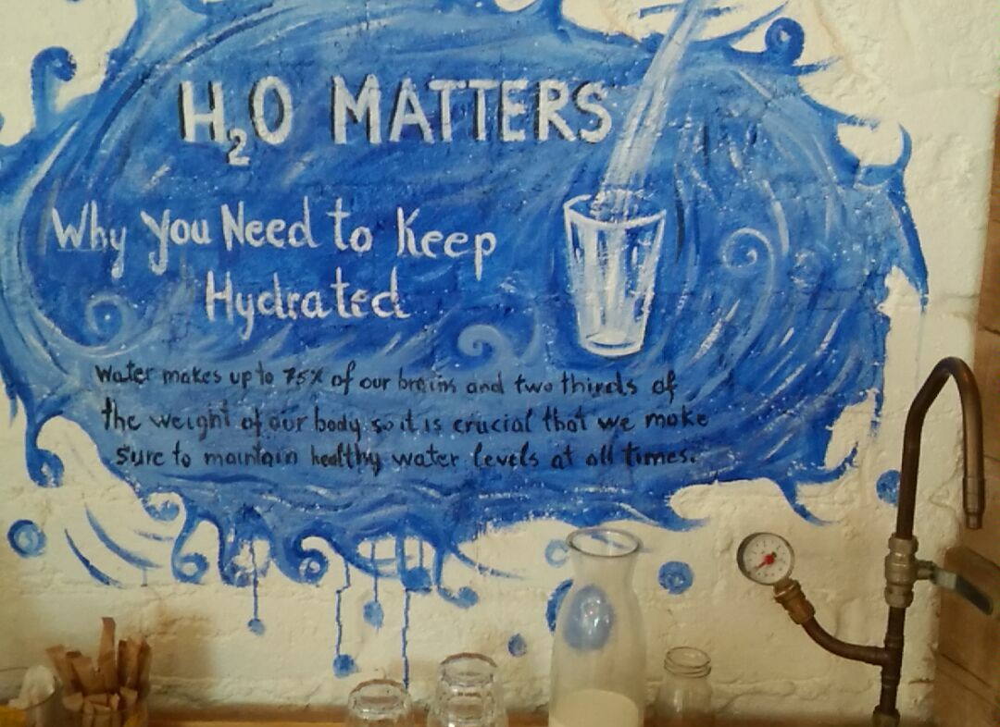

[](documentation.md)

# MDMA



# introduction

Amphetamine (speed, Adderall) is a semipotent stimulant. Methamphetamine is an amphetamine molecule with an extra methyl group which gives it the ability to cross the blood-brain barrier more efficiently and, in turn, makes it much more potent than regular amphetamine. MDMA (methyldioxymethamphetamine) and MDA (methyldioxyamphetamine)) are designer amphetamines with stimulant and mild hallucinogenic properties.

# usage

- before taking
    - combat jaw-clenching
        - Magnesium B6 ([Amazon France](https://www.amazon.fr/gp/product/B00714V4FI))
        - Magnesium B6 ([Amazon UK](https://www.amazon.co.uk/gp/product/B007Z5X0HS))
- after comedown
    - resupply tryptophans
        - 5-HTP (likely avoid 48 hours before and after)
            - [Restoration of 3,4-methylenedioxymethamphetamine-induced 5-HT depletion by the administration of L-5-hydroxytryptophan](https://www.ncbi.nlm.nih.gov/m/pubmed/17629409)
        - carbohydrates

# caution

```
When Little Timmy took an 'E'
to while away the night:
"I barely felt a *thing*", said he,
and spoke, "This can't be right."

He waited half a second's span --
a moment more, or two --
and when, at last, the next began,
he wondered what to do.

"Perhaps it takes a *few* before
it settles in" he sighed,
so Timmy swallowed sixty more

and Timmy fucking died.
```

# get

## Dream (obsolete)

- [Dream AliBabauk](http://vilpaqbrnvizecjo.onion/contactMember?member=AliBabauk)

## Alphabay (obsolete)

- [AlphaBay (closed) louboutinUK](http://pwoah7foa6au2pul.onion/user.php?id=louboutinUK) ([2017-02 50 pills for 131.70 USD](http://pwoah7foa6au2pul.onion/listing.php?id=203838))

# references

- [Bright Star's MDMA Synthesis for the First Time Chemist](MDMA/Bright_Star_MDMA_Synthesis_for_the_First_Time_Chemist.pdf)
- [Equivalent effects of acute tryptophan depletion on REM
sleep in ecstasy users and controls (2009)](carhart-harris2009.pdf)
- [The effect of acutely administered MDMA on
subjective and BOLD-fMRI responses to favourite
and worst autobiographical memories (2014)](MDMA/The_effect_of_acutely_administered_MDMA_on_subjective_and_BOLD-fMRI_responses_to_favourite_and_worst_autobiographical_memories.pdf)
- [Making a medicine out of MDMA (2015)](MDMA/Making_a_medicine_out_of_MDMA.pdf)
- [Ecstasy (MDMA) and oral health (2008-01-26)](MDMA/Ecstasy_MDMA_and_oral_health.pdf)
- [Restoration of 3,4-methylenedioxymethamphetamine-induced 5-HT depletion by the administration of L-5-hydroxytryptophan (2007)](Restoration_of_34-methylenedioxymethamphetamine-induced_5-HT_depletion_by_the_administration_of_L-5-hydroxytryptophan.pdf)
