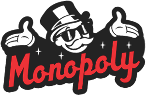
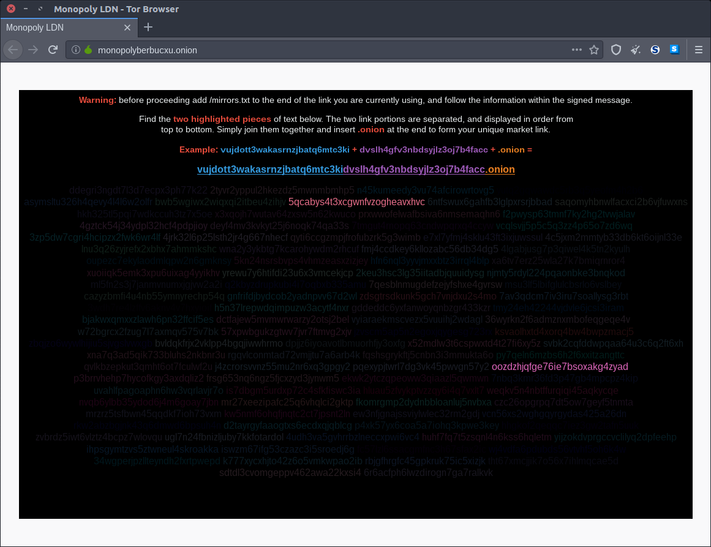

# Monopoly

Monopoly is a [Monero](Monero.md)-centered [darknet market](dark_markets.md) (with [Bitcoin](Bitcoin.md) as an option) that does not require a user account in order to purchase. Details such as a [PGP](PGP.md) public key and [PGP](PGP.md) encrypted delivery instructions are added at checkout. Payment details are presented on purchase and an order then stays in existence for 12 hours, waiting for detection of payment.

## Monopoly approach to rotating mirrors

