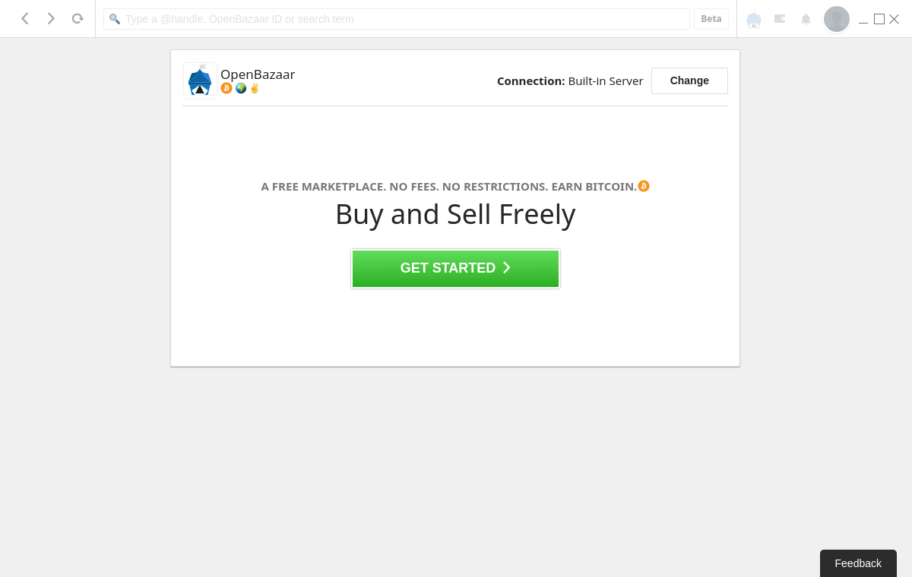

[](documentation.md)

# OpenBazaar (peer-to-peer market)

- [OpenBazaar](https://openbazaar.org/)

OpenBazaar is a network for trading goods and services directly between people using Bitcoin without any central organization controlling the platform. This means you are responsible for your own activity on the network. Users are not anonymous by default. Most communications between parties are encrypted, but IP addresses are public and can be associated with activity on the network. Malicious parties could use this information against you; protecting your privacy is your own responsibility. The OpenBazaar community of developers has worked hard to deliver a free platform for trade to the world.

## setup

- <https://www.openbazaar.org/download>

```Bash
sudo dpkg -i openbazaar2_2.0.11_amd64.deb
openbazaar2
```

## usage


