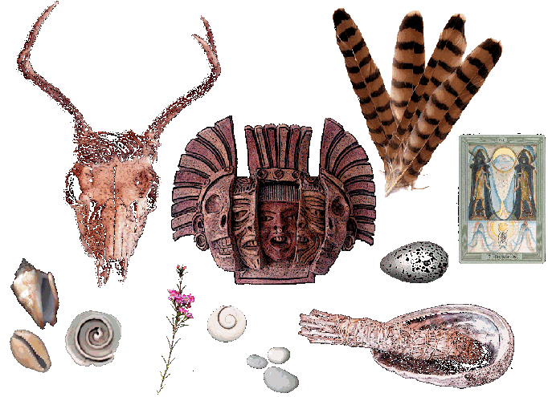
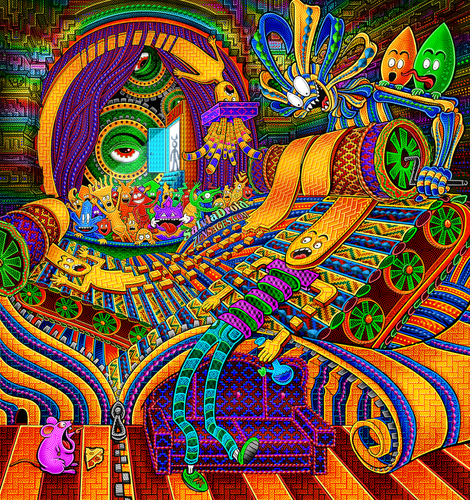
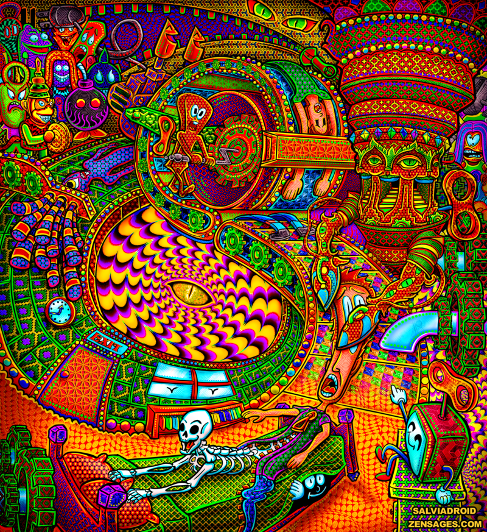

# Salvia

<video src="media/petey_Short_Animatio.mp4" controls>
</video>

# references

- [The Salvia divinorum User's Guide (2008-09-27, Daniel Siebert)](Salvia/2008-09-27_Salvia_divinorum_usersguide.pdf)
- <http://www.sagewisdom.org/>
- [What is the function of the claustrum?](Salvia/What_is_the_function_of_the_claustrum.pdf)
- [Electrical stimulation of a small brain area reversibly disrupts consciousness (2014)](Salvia/Electrical_stimulation_of_a_small_brain_area_reversibly_disrupts_consciousness.pdf)
- [Salvia divinorum: A Psychopharmacological Riddle and a Mind-Body Prospect (2013)](Salvia/Salvia_divinorum_A_Psychopharmacological_Riddle_and_a_Mind-Body_Prospect.pdf)
- [The claustrum’s proposed role in consciousness is supported by the effect and target localization of Salvia divinorum](2014-02-26)](Salvia/The_claustrums_proposed_role_in_consciousness_is_supported_by_the_effect_and_target_localization_of_Salvia_divinorum.pdf)
- [Pharmacokinetics of the potent hallucinogen, salvinorin A in primates parallels the rapid onset and short duration of effects in humans (2008)](Salvia/Pharmacokinetics_of_the_potent_hallucinogen_salvinorin_A.pdf)
- [Metabolic Changes in the Rodent Brain after Acute Administration of Salvinorin A (2009)](Salvia/Metabolic_Changes_in_the_Rodent_Brain_after_Acute_Administration_of_Salvinorin_A.pdf)

# purchase

- [Avalon Magic Plants](https://www.avalonmagicplants.com/)

# notes

## 2017-01-22T2038Z WBM

I suspect that salvia induces some form of proprioceptive synesthesia. Proprioception is the sense of the position of the body in space. Salvia seems to fuck with this sense. At low doses, there are reports of people stumbling around. At higher doses, there are reports of the body shrinking or expanding, turning into inanimate objects, fragmenting into pieces, feeling forces pulling the psychonaut through space etc.

It may be that on salvia, the brain recruits the tissue that normally computes the spatial location of the body for other purposes, like abstract thought. This would then be another form of synesthesia that is specific to this drug.

[A study on mice](http://www.sagewisdom.org/hookeretal2.pdf) suggests that brain regions like the cerebellar vermis (associated with posture and locomotion) and the periaqueductal gray (centre for pain modulation) are used more than usual on salvia. Damage (i.e. lesions) to the cerebellar vermis can  give rise to clinical depression, inappropriate emotional displays (e.g. unwarranted giggling) and movement disorders.

On salvia, there can be a slightly impersonal sense of conscious entities. There can also be a sense of being chided for one's state of mind.

Crick and Koch suggested that [the claustrum](http://www.klab.caltech.edu/news/crick-koch-05.pdf) might be particularly important for generating consciousness. The claustrum is a thin strip of neurons that sits deep in the center of the brain. It sends connections to many areas of the brain and receives many back. In particular, it connects areas of the brain known to have important roles in aspects of perception: vision, movement and hearing. Brain imaging studies show that the claustrum is activated when participants perform tasks requiring multiple senses. Crick and Koch's hypothesis is that the claustrum sits amidst all the many perceptions of the outside world and binds them together, creating one coherent consciousness. It could be that the claustrum serves as a conductor for certain aspects of higher-order integration of brain activity. It may be that it is essential in multisensory integration. What might happen if the claustrum is shut down, if the supposed conductor of the orchestra of consciousness is lost?

The main psychoactive compound of Salvia divinorum, Salvinorin A, binds to receptors in the claustrum and shuts it down. Salvia psychonauts report that they lose their sense of body ownership and lose perception of the outside world. Salvia is the only known psychedelic with a confirmed link to the claustrum. A study was done on an individual that involved stimulation of a part of the brain including the claustrum using electrodes. Whenever this area was stimulated, the subject would stare blankly ahead and cease to perform any requested tasks. EEG measurements during the stimulation show nothing changing in the electrical activity of the brain as a whole.

Little is known about the function of the claustrum. Connectivity studies have shown that the claustrum plays a strong role in communication between the two hemispheres of the brain, specifically between cortical regions controlling attention. One goal of these connections could be to create a common timescale between the two hemispheres, which might help to achieve a seamless unity of attention/consciousness between processing in each hemisphere.

# Salvia trips can be challenging

<iframe width="560" height="315" src="https://www.youtube.com/embed/7nG1_QuI1v0" frameborder="0" allow="accelerometer; autoplay; encrypted-media; gyroscope; picture-in-picture" allowfullscreen></iframe>
