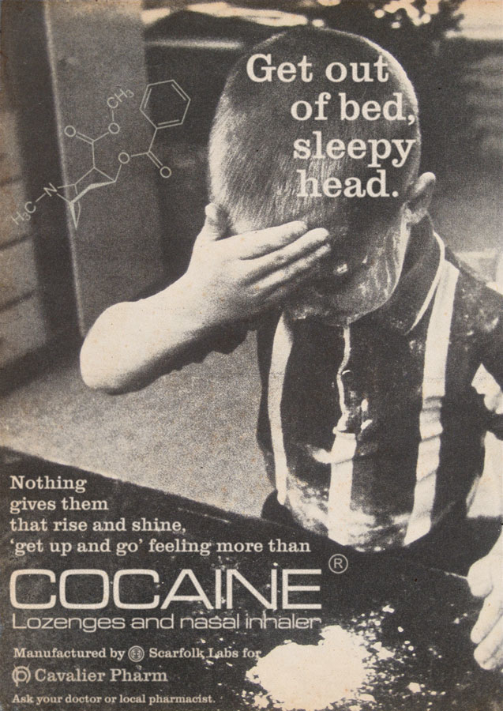
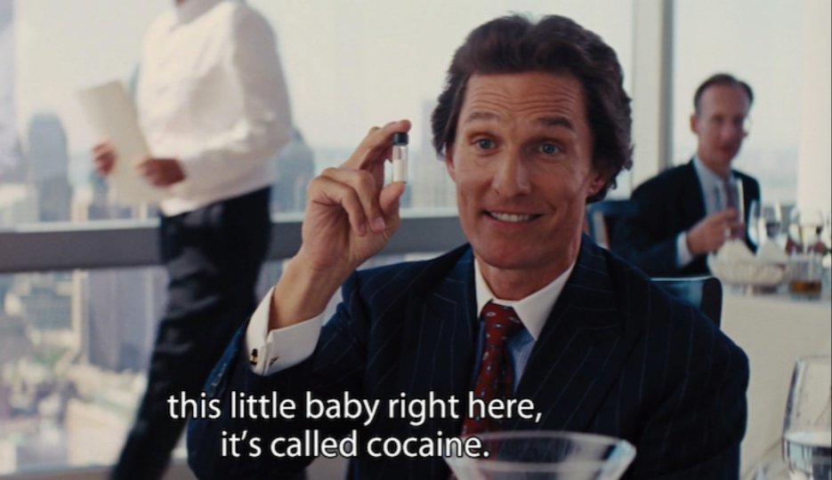
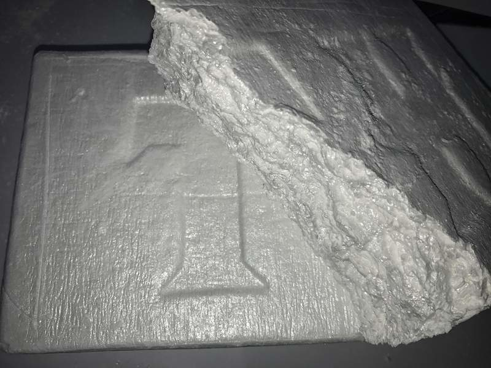
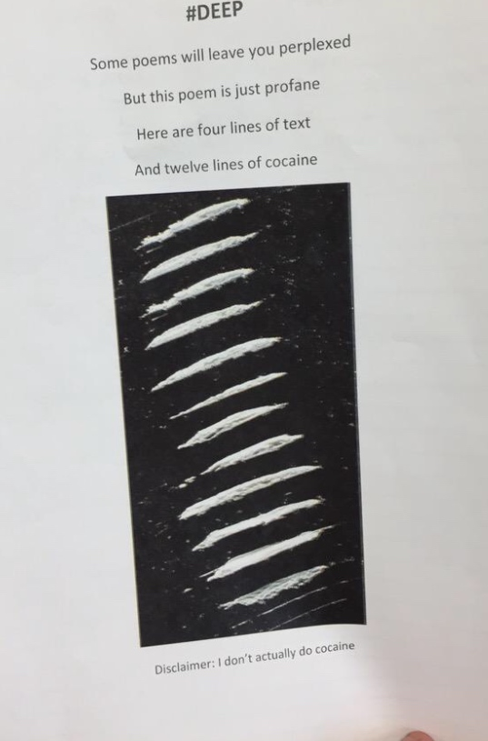

[](documentation.md)

# cocaine




Chronic cocaine intake causes strong imbalances of transmitter levels in order to compensate extremes. Thus, receptors disappear from the cell surface or reappear on it, resulting more or less in an "off" or "working mode" respectively, or they change their susceptibility for binding partners (ligands) -- mechanisms called downregulation and upregulation. However, studies suggest cocaine users do not show normal age-related loss of striatal dopamine transporter (DAT) sites, suggesting cocaine has neuroprotective properties for dopamine neurons.

In 2011, researchers at John Jay College of Criminal Justice reported that dietary zinc supplements can mask the presence of cocaine and other drugs in urine. [doi:10.1093/anatox/35.6.333](https://doi.org/10.1093/anatox/35.6.333)

# get



## NextGeneration



- notes: decent quality, *accepts Monero*, accepts Bitcoin, pretty brisk
- note: due to stop selling on Empire Market soon, will be selling on:
    - Cryptonia
    - Berlusconi
    - Samsara
    - Monopoly
- [Empire Market](alu4z7a3upjtlqva.onion/u/NextGeneration)
    - 2019-12-09T1630Z [UNCUT Peruvian 89% FISHSCALE COCAINE 3.5g](http://v6u2ngtpiihou77b.onion/product/23954/105/147434)
        - 0.037159 BTC = 6.083430 LTC = 5.095851 XMR
    - [UNCUT Peruvian 89% FISHSCALE COCAINE 3.5g](alu4z7a3upjtlqva.onion/product/23954/105/147434)
    - 0.028801 BTC = 269.94 USD = 4.454815 XMR
- obsolete
    - [Dream account](http://t3e6ly3uoif4zcw2.onion/contactMember?member=NextGeneration)
        - ["UNCUT Peruvian 89% FISHSCALE COCAINE 3.5g FREE UK"](http://t3e6ly3uoif4zcw2.onion/viewProduct?offer=917155.170616)

contact details:

- <NextGeneration@lelantos.org>
- <NextGeneration@sigaint.org>

PGP:

```
-----BEGIN PGP PUBLIC KEY BLOCK-----
Version: GnuPG v2.0.14 (GNU/Linux)

mQENBFSSmVwBCADGG+I/43ZPa/kg2yjo7aGK9asrmOog/Bhu1AW7bPzhP9lNXNzX
9NpQQ6s0SB5RrY2VHLH32MBc//Ee7gWPvA3X+XFj6yvYNHoUFJ9R5jU5yIsKgcqq
1kaBMRNsB/446zlVomMzx3EA0ih2U7XQu2cH5iGRjvofWf6rze/R8ILNGwW22F7M
ksPzNxzLjOQn77QmSUFVCQeUmcDW7MtXuxmQx5+VIBB/gB8X9PoM2BGQ0Q5FcJ8U
4crKIzBEWpfds5msyobenDej+m0v3X6Qhpq2aT7hqh3Y9wu6I/A37VX6c/ah8Sav
wnYe1bQGna6xpxLgO1wvMrs77m6KMx+4YuezABEBAAG0IE5leHRHZW5lcmF0aW9u
IDxpbkBvdXQubm8uZG91YnQ+iQE5BBMBAgAjBQJUkplcAhsDBwsJCAcDAgEGFQgC
CQoLBBYCAwECHgECF4AACgkQHRrE07VVL/vJDQgAjQJRVWGxuWmI46OXDNq3qgQf
BSoTbYgsmzOdWMB5IiUx4cB81y6GHYwn0PJOmuOodRYr5wRFEvuPPD1djBgSfLgt
CUDaoQdXCirpk/4LRdzPUvcXe9K4ZFGyNpb3uK1Hd2Rg5F9CB3mwwudJX8SyqcN4
YBf54qHk0yuRytfExSeuk//WEvGMFTRb5+Q2RTRc1oZIRmOkX6anMIOoL+e3xS5c
ugKbNeHt3vmrWW/d8TVLGwaDf8t+Ewmnbi7FwTMC+HC6PYr0DkJVVdrIDu7sZWQD
8MfYakREoTWthwK36Lr0xWRMvKyUq7CNx352Gi691YzMFeXu7ZF0W2cTDWuygLkB
DQRUkplcAQgAzqxVytv+t8bXPUNciCvy/TRW7XRo/JpAutXl5UGLfKSO8/BUk6VU
MonEWUYHJ+m1TPs41dgBHc5tqg/ZPrME0WblbkzN3l81VhflJPgBRtOUtvJflZM3
VeHzWrcsK6eWzjThF9HZnm2ovjgpy4DLq/5DiTv25dsaxHqD+8QlTdlORwv+9BzW
wYXj6E0PgEMcONYLydq8P5nJ0EDebpx6imaXJ5JUoidNfHKgtThIVgI6iBnRfoJm
fSOGKWsPLlYm9oQLGImR+Y4npTthh0VYbdy2tOqifhq264b4HzWmlaRkaZutSap6
NhAR8vim7YpYJXDgzfNlxwZiZ+a+9aRWkQARAQABiQEfBBgBAgAJBQJUkplcAhsM
AAoJEB0axNO1VS/7IRsIALXd/AzHHnanpcDGFRkrpwNCpNr3MYREBBKY3K6dbLU4
2Z88CWFNrSdswmwfizMIZXN1VF3vQV2Qg6VFywbz/iTKPQ50sDDDDKb2vOzP8oaK
h7dlFAFzB4fPxIE8ynopkeaWYSoiftHGbqyFxrUhKmJzDyDQAyKkzFrx/4M3pCRM
YtZrj5x9ZF+tHmduuZxq5HgT7+iSPq4y+c2TR9gLUTbmHyNfP4ta9UjMyyouvvP/
OtnDqID7rPxapKklGBYM3lMbIrWr6Qxw+swUtPWkbEY7QIeGPUCeHKT4QzNtRMr+
gQZD8NWKEWyOSxWQ8k4nlmLwEPi2R/DvbQuJBC+kHW0=
=vPDD
-----END PGP PUBLIC KEY BLOCK----- 
```

## obsolete sellers

- [Dream ScarlettsK](http://t3e6ly3uoif4zcw2.onion/contactMember?member=ScarlettsK) (obsolete)

# cocaine poetry


