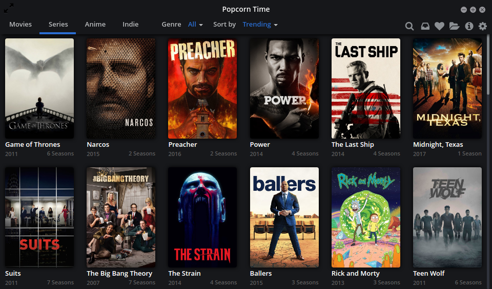
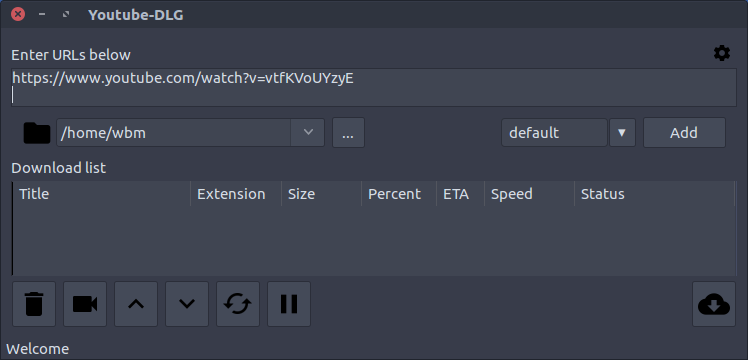
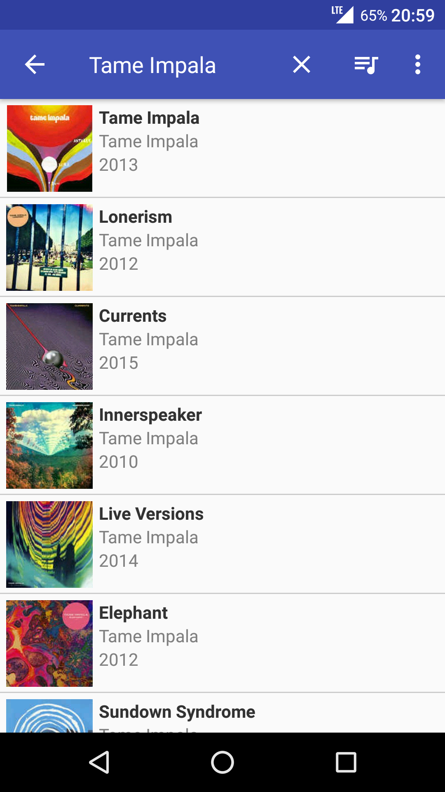
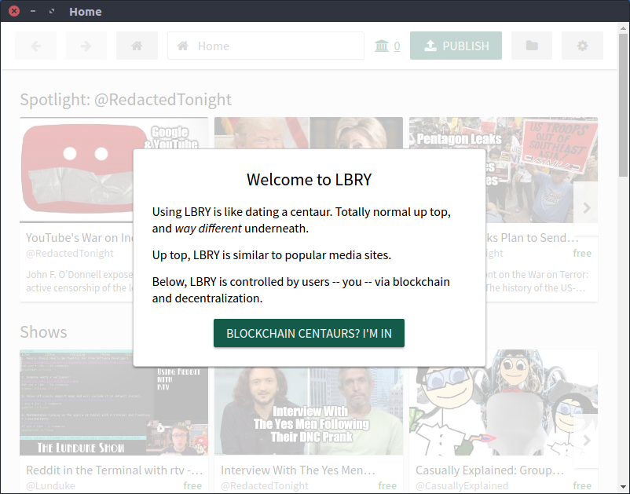

[](documentation.md)

# rights to culture and science (UDHR Article 27.1)


Sites are listed first, then some useful programs are described in their own sections.

# sites, tools and extensions

- books
    - [BookFi](http://en.bookfi.net)
    - [BookID](http://en.booklid.org)
    - [B-OK](http://b-ok.org), [B-OK](https://b-ok.cc)
    - [KickassTorrents](https://kickass.unblocked.lol)
    - [Antilibrary](http://127.0.0.1:43110/Antilibrary.bit) (ZeroNet)
    - [Mobilism](https://mobilism.org/app)?
        - [demonstration](https://gfycat.com/vibrantunequaledgharial)
- videos
    - [PeerTube](https://peertube2.cpy.re)
    - [The Pirate Bay](https://piratebay.website)
    - [KickassTorrents](https://kickass.unblocked.lol)
    - [Torrentz2](https://torrentz2.eu)
    - [Alluc](http://www.alluc.ee)
    - [Watch-free.me](http://watch-free.me)
    - [Watch-free.pro](http://watch-free.pro)
    - [Tify.tv](http://yify.bz)
    - [My Download Tube](http://www.mydownloadtube.com)
    - [Popcorn Time](https://popcorntime.sh)
    - [youtube-dl](https://github.com/rg3/youtube-dl)
- papers
    - [Sci-Hub](https://sci-hub.tw/)
        - [Looking into Pandora's Box: The Content of Sci-Hub and its Usage](https://f1000research.com/articles/6-541/v1)
        - [2017-03-19 list of all DOIs collected on Sci-Hub](https://twitter.com/Sci_Hub/status/843546352219017218)
        - backups
            - <https://sci-hub.tw>
            - <http://sci-hub.la>
            - <http://sci-hub.bz>
            - <http://tree.sci-hub.la>
            - <http://sci-hub.mn>
            - <http://sci-hub.name>
            - <http://sci-hub.tv>
            - <http://sci-hub.tw>
            - <http://sci-hub.hk>
            - <http://80.82.77.83>
            - <http://80.82.77.84>
            - <https://scihub22266oqcxt.onion.link>
        - obsolete
            - <http://www.sci-hub.cc>
            - <http://31.184.194.81>
    - [Library Genesis](http://gen.lib.rus.ec) (search for ISBN from Amazon, then search)
- textbooks
    - [Library Genesis](http://gen.lib.rus.ec)
        - backups
            - <https://www.archiveteam.org/index.php?title=Library_Genesis#Database_dumps>
            - <http://gen.lib.rus.ec/dbdumps>
            - <http://gen.lib.rus.ec/dbdumps/?C=M;O=D>
            - <http://gen.lib.rus.ec/repository_torrent>
    - [Ebooks Search Engine (Google custon search engine)](http://www.google.com/cse/home?cx=000661023013169144559:a1-kkiboeco)
    - [Textbook Nova](http://textbooknova.com)
    - [Project Gutenberg](http://www.gutenberg.org)
    - [Ebookee](http://ebookee.org)
    - [ManyBooks](http://www.manybooks.net)
    - [Giuciao](http://www.giuciao.com)
    - [FeedUrBrain](http://www.feedurbrain.com)
    - [Online Library of Liberty](http://oll.libertyfund.org/index.php?option=com_content&task=view&id=380)
    - [AB Alleng (Russian)](http://www.alleng.ru)
    - [eKnigu (Russian)](http://www.eknigu.com)
    - [iask (Chinese)](http://ishare.iask.sina.com.cn)
    - [2020ok](http://2020ok.com)
    - [FreeBookSpot](http://www.freebookspot.es/Default.aspx)
    - [Free The Textbooks!](http://www.freeetextbooks.com) (signup)
    - [One Big Torrent](http://onebigtorrent.org)
    - [MVGroup](http://forums.mvgroup.org) (need to register)
    - [AudioBook Bay](http://theaudiobookbay.com) (audiobooks)
- data
    - [Academic Torrents](http://academictorrents.com)
- music
    - [Torch Music](https://music.torchbrowser.com/trending)
        - [Refreex](https://github.com/refreex/refreex-desktop)
    - [MP3FY](https://www.mp3fy.com/music)
    - [Bandcamp Downloader](https://chrome.google.com/webstore/detail/bandcamp-downloader/nmoobgpmablfmgchfjnhkbloaobiogeh/related?hl=en)
    - [Funkytunes (BitTorrent-based music application for Android](https://github.com/funkyg/funkytunes))
- cyber
    - [AirVPN](https://github.com/wdbm/resources_AirVPN)
- dead
    - [Electronic Library](http://en.bookfi.org)
    - [downeu](http://www.downeu.me/ebook)

# Popcorn Time -- torrent and video player program



- [Popcorn Time](https://popcorntime.sh)

# youtube-dlg -- YouTube and other media downloader



`youtube-dlg` is a GUI for the `youtube-dl` utility for downloading YouTube and other media. On installation, `youtube-dl` installs a local copy of `youtube-dl`.

```Bash
sudo pip install youtube-dlg
```

# Funkytunes -- BitTorrent-based music application for Android



- [Funkytunes](https://github.com/funkyg/funkytunes))

# LBRY -- blockchain distributed file metadata, with DHT-bitorrent style P2P network



- [LBRY](LBRY.io)
