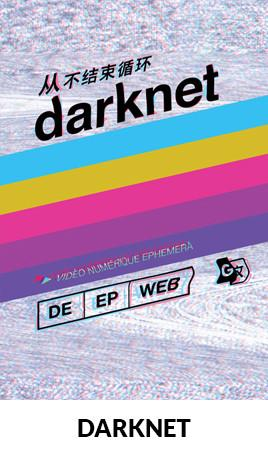

# cyberspace!

# note

Privacy is important for at least two reasons. One is the right to privacy, such as that described roughly by [UDHR Articles 12 and 18](https://www.un.org/en/universal-declaration-human-rights). Another is to ensure that [fascism is not permitted to be efficient](https://www.ted.com/talks/yuval_noah_harari_why_fascism_is_so_tempting_and_how_your_data_could_power_it).

Knowledge of darknet sites, privacy technologies and other ideas is important to cybersecurity researchers. The documentation here is provided for information only. No endorsements are made or implied regarding any sites or organizations mentioned here.

No attempt has been made to support closed source -- and, hence, insecure -- operating systems like macOS and Windows in this documentation. All closed source operating systems controlled by companies headquarted in the USA, a country with secret laws, secret courts and secret gag orders, must be considered a security risk and to possibly feature backdoors, keylogging and the like. The only realistic secure alternative is a GNU/Linux distribution, e.g. Ubuntu, Tails, Trisquel. A libre computer is desireable in order to ensure security, such as the [Libreboot X200 ThinkPad Tablet](https://minifree.org/product/libreboot-x200-tablet). You could consider installing the security kill-switch [usbkill](https://github.com/hephaest0s/usbkill).

- [example gag order used by the FBI on Google](https://assets.documentcloud.org/documents/4756552/Gag-Order-on-Google-Re-Android-Search-Warrant.pdf) ([backup](cyberspace/Gag-Order-on-Google-Re-Android-Search-Warrant.pdf))
    - [background](https://www.forbes.com/sites/thomasbrewster/2018/08/15/to-catch-a-robber-the-fbi-attempted-an-unprecendeted-grab-for-google-location-data) ([backup](cyberspace/2018-08-15_To_Catch_A_Robber_The_FBI_Attempted_An_Unprecedented_Grab_For_Google_Location_Data.pdf))

Use a live distribution (booted from USB as opposed to installed on HD) if possible, but if using an installed operating system, then ensure that it is installed with encryption and that passcodes and the like are stored in an obscured way in a VeraCrypt container.

# prerequisite knowledge for purchasing drugs on typical darknet markets

- 2-factor authentication
- VPN
- Tor
- getting Monero (e.g. on Kraken) (preferable to Bitcoin for privacy)
- getting Bitcoin (e.g. on LocalBitcoins) (not essential if Monero is used)
- PGP

# sections of cyberspace documentation

|**documentation**                                                      |**description**                            |
|-----------------------------------------------------------------------|-------------------------------------------|
|[hardware](hardware.md)                                                |OPSEC hardware                             |
|[DNM Bible](DNM_Bible.md)                                              |OPSEC DNM Bible                            |
|[Tails](Tails.md)                                                      |privacy-centric live GNU/Linux distribution|
|[computing security introduction](computing_security_introduction.md)  |                                           |
|[VeraCrypt](https://github.com/wdbm/resources_VeraCrypt)               |encrypted volumes using VeraCrypt          |
|[2-factor authentication](2fa.md)                                      |                                           |
|[communications](communications.md)                                    |secure communications, P2P communications  |
|[PGP](PGP.md)                                                          |PGP                                        |
|[QR codes](QR.md)                                                      |generating and using QR codes              |
|[Bitcoin](Bitcoin.md)                                                  |                                           |
|[Monero](Monero.md)                                                    |                                           |
|[dark markets](dark_markets.md)                                        |                                           |

# references, list of decentralized web technologies

- [Decentralized Web Summit](http://www.decentralizedweb.net)
- [Mouse Reeve: Technologies of the Decentralized Web Summit 2016](https://blog.mousereeve.com/technologies-of-the-decentralized-web-summit)
- [Reddit RCSources](https://www.reddit.com/r/RCSources)
- [Reddit ResearchChemicals](https://www.reddit.com/r/researchchemicals)
- Tor links
    - web utilities
        - [TorNote (Tor Pastebin service)](http://pbixezpipydasmej.onion)
        - [Post It! (Tor Pastebin service)](http://postits4tga4cqts.onion)
        - [Matrix Image Uploader (stores image for ~7 days)](http://matrixtxri745dfw.onion)
    - Bitcoin
        - [BitBlender (Bitcoin tumbler)](bitblendnlwgkhsr.onion)
        - [Bitmixer.io (Bitcoin tumbler)](http://bitmixer3gwvbgzw.onion)
    - defense
        - [UK guns and ammunition](http://tuu66yxvrnn3of7l.onion)
    - identification
        - [UK passports](http://vfqnd6mieccqyiit.onion)
    - drugs
        - [Silk Road V3](http:/reloadxuwmn4gkbe.onion)
        - [BitPharma](http://s5q54hfww56ov2xc.onion)
    - piracy
        - [The Pirate Bay](jntlesnev5o7zysa.onion)
    - money
        - [The Green Machine](http://zzq7gpluliw6iq7l.onion)
        - [The PayPal Cent (PayPal accounts)](http://nare7pqnmnojs2pg.onion)
- blockchain infrastructure
    - [Blockstack](https://blockstack.org) -- platform for application development with built-in decentralized DNS
    - [Ethereum](https://ethereum.org) -- "a distributed answer to HTTP POST" -- a blockchain-based platform for decentralized app development
    - [Namecoin](https://namecoin.info) -- replacement for the existing domain name system that registers identities on a blockchain, rather than a centralized DNS authority
    - [Zcash](https://z.cash) -- a cryptocurrency built for total privacy. Zcash encrypts transactions so that they can be validated while still private.
    - [Backfeed](http://backfeed.cc) -- technology to enable decentralized and user-owned governance and reputation management for a community
- communication
    - [BitMessage](https://en.wikipedia.org/wiki/Bitmessage) -- anonymous encrypted message broadcasting
    - [Matrix](https://matrix.org) -- an open standard for decentralized persistent communication over IP. Matrix wants to connect together all the various communication services and make them interoperate.
    - [Solid](https://solid.mit.edu) -- proposed set of conventions and tools for building decentralized social applications based on Linked Data principles
    - [LevelNews](https://levelnews.org) -- leftist news aggregator designed for an open web and dedicated to journalism without censorship
    - [Interledger](https://interledger.org) -- interconnects disparate cryptocurrencies and financial systems
- databases
    - [BigchainDB](https://www.bigchaindb.com) -- scalable database that layers blockchain technology over decentralized data
    - [IPDB](https://ipdb.foundation) -- federated database network built on BigchainDB and IPFS. It is maintained by a network of caretakers around the world, at least half of which are nonprofits.
- data storage and sharing
    - [BitTorrent](https://en.wikipedia.org/wiki/BitTorrent) -- protocol for distributed file sharing
    - [WebRTC](https://en.wikipedia.org/wiki/WebRTC) -- W3C drafted standard for browser-to-browser data transfer
    - [WebTorrent](https://webtorrent.io) -- in-browser torrenting that works without requiring users to install anything extra
    - [DAT Project](http://dat-data.com) -- torrent-based public data storage, versioning, and sharing aimed at scientists, or anyone else with data
    - [IPFS](https://ipfs.io) -- or InterPlanetary File System, is a distributed file storage system that aims to replace HTTP
    - [Tahoe-LAFS](https://www.tahoe-lafs.org/trac/tahoe-lafs) -- a private, encrypted file storage system that decentralizes data across multiple servers
- decentralized web
    - [ZeroNet](https://zeronet.io) -- peer-to-peer web built on the Bitcoin blockchain for addressing, and identity and Namecoin for .bit domains
    - [Freenet](https://freenetproject.org) -- network aimed at activists and people living in repressive regimes. It uses a web of trust in high security mode, which allows users on the network to be effectively undetectable.
    - [MaidSafe](http://maidsafe.net) -- upcoming decentralized internet and application infrastructure which rewards users for participating in the network
    - [I2P](https://geti2p.net) -- anonymous network with hidden services
    - [Tor](https://www.torproject.org) -- anonymous network proxy
- marketplaces
    - [OpenBazaar](https://openbazaar.org) -- Marketplace with store fronts and moderators
    - [Dream](http://t3e6ly3uoif4zcw2.onion/?ai=1675)
- miscellaneous
    - [Mediachain](http://www.mediachain.io) --  media library built on IPFS that makes it easy to publish, track, and discover creative work.
    - [IPWB](https://github.com/oduwsdl/ipwb) -- interplanetary wayback machine
    - [Onename](https://onename.com) -- global database for people, companies, websites and more
    - [StrongLink](https://github.com/btrask/stronglink) - a searchable, syncable, content-addressable notetaking system
- microblogging
    - [trsst](http://www.trsst.com) -- looks and feels like Twitter but encrypted and anonymized and decentralized and only users hold the keys
    - [Tahrir](http://tahrirproject.org) -- looks and feels like Twitter but encrypted and anonymized and decentralized and only users hold the keys
    - [Twister](http://twister.net.co) -- a fully decentralized P2P microblogging platform leveraging the free software implementations of Bitcoin and BitTorrent protocols

