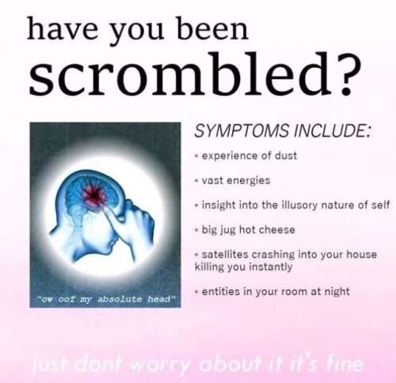
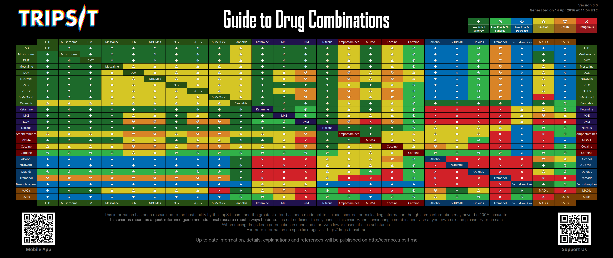

"Everyone carries a piece of the puzzle. Nobody comes into your life by mere coincidence. Trust your instincts. Do the unexpected. Find the others." -- Timothy Leary

---

# quick statement

This documentation does not seek to suggest unethical behaviour nor does it seek to offer medical advices that are not evidence-based.

# on-drug checklist

- You are on a drug and it is temporary.
- Do not take your clothes off until you are 100 % sure you are at home.
- Tie things to yourself (e.g. telephone, keys, wallet).

- [Too high? Watch this video.](https://www.youtube.com/watch?v=_mUvG6x53VM)

- [USE THE OPERATING SYSTEM](http://www.windows93.net)
- [WATCH THE TELEVISION](https://helloeko.com/v/like-a-rolling-stone?autoplay=true)

# quick links

- [playlist drugs_enhumourous](https://www.youtube.com/watch?v=nsvlFbPgWj8&list=PLkRUq7qfaYMFeM2snqSk5xTHNaWSg-jnS)
- [playlist drugs_tripster](https://www.youtube.com/watch?v=mTppEXUZDZM&list=PLkRUq7qfaYMHSFfpHCmSmNje4lde5paZV)
- [playlist drugs_nature](https://www.youtube.com/watch?v=EM9yDQMpn0c&list=PLkRUq7qfaYMF6FmR6fHHcIezs5ODRXovv)
- [playlist Right Here](https://www.youtube.com/playlist?list=PLjBN9mzHxXogXan1dsQQaI64WRJVyVdxV)
- [playlist Pouff](https://www.youtube.com/channel/UCMdWlpaoqbWdbvEt0hHsl_Q) (LSD simulation videos)
- [z0r](http://z0r.de)
- [Electric Sheep](https://www.youtube.com/watch?v=O5RdMvgk8b0) (hours of fractal animations)

# contents conceptual tree

- [set and setting](set_and_setting.md) (checklists, calm, sedation, Xanax)
- [coming down](coming_down.md) (coming down)
- [culture](culture.md) (bypass paper paywalls, get books etc.)
- [cyberspace](cyberspace.md) (2FA, Tor, VPN, PGP, Bitcoin, MAC, AlphaBay)
    - [AirVPN](https://github.com/wdbm/resources_AirVPN) (VPN service)
    - [hardware](hardware.md) (OPSEC hardware)
    - [DNM Bible](DNM_Bible.md) (OPSEC DNM Bible)
    - [Tails](Tails.md) (privacy-centric live GNU/Linux distribution)
    - [computing](computing_security_introduction.md) (security introduction)
    - [VeraCrypt](https://github.com/wdbm/resources_VeraCrypt) (encrypted volumes using VeraCrypt)
    - [2-factor authentication](https://github.com/justakissaway/dark/blob/master/documentation/2fa.md)
    - [communications](communications.md) (secure communications, P2P communications)
    - [PGP](PGP.md) (PGP)
    - [QR codes](QR.md) (generating and using QR codes)
    - [Bitcoin](Bitcoin.md)
    - [Monero](Monero.md)
    - [dark markets](dark_markets.md)
        - [Empire Market](Empire_Market.md)
        - [Monopoly](Monopoly_Market.md)
        - [OpenBazaar](OpenBazaar.md)
        - [Dream Market](Dream_Market.md)
        - [AlphaBay](AlphaBay.md)
- [spatial security](spatial_security.md) (securing a room or tangible property)
- [protests](protests.md) (security in protest environments)
- [legal](legal.md) (legal status of things, psyceactivism)
- [replications](replications.md) (visuals and other simulations)
- [laservision](laservision.md) (cognitive enhancement)
- drugs
    - [2C-B](2C-B.md)
    - [cocaine](cocaine.md) (Peruvian marching powder)
    - [DMT](DMT.md) (shrooms++)
    - [ketamine](ketamine.md) (for Bojack)
    - [lidocaine](lidocaine.md)(surgery "in the field")
    - [LSD](LSD.md)
    - [MDMA](MDMA.md)
    - [mescaline](mescaline.md)
    - [Modafinil](Modafinil.md) (laservision)
    - [oxycodone](oxycodone.md) (best served with chamomile tea?)
    - [pentobarbital](pentobarbital.md) (So you've decided to kill yourself!)
    - [Salvia](Salvia.md) (underground machine world, land of the dead)
    - [scopolamine](scopolamine.md)
    - [shrooms](shrooms.md)
    - [weed](weed.md) (The Devil's Spinach)
    - [Xanax](Xanax.md) (for knitting up ravelled sleeves)

# drugs in general

# references

- [Lifetime experience with (classic) psychedelics predicts pro-environmental behavior through an increase in nature relatedness](Lifetime_experience_with_(classic)_psychedelics_predicts_pro-environmental_behavior_through_an_increase_in_nature_relatedness.pdf)
- [How Academia Resembles a Drug Gang (2013-12-11)](http://blogs.lse.ac.uk/impactofsocialsciences/2013/12/11/how-academia-resembles-a-drug-gang) ([backup link](2013-12-11_How_Academia_Resembles_a_Drug_Gang_--_Alexandre_Afonso.pdf))
- [Drug harms in the UK: a multicriteria decision analysis (2010)](nutt2010.pdf)
- [PiHKAL](PiHKAL.pdf)
- [TiHKAL](TiHKAL.pdf)
- [The Psychedelic Explorer's Guide -- James Fadiman](The_Psychedelic_Explorers_Guide_--_James_Fadiman.epub)
- [Total Synthesis II](http://www.wdbm.pro:8080/open/library/drugs/Total_Synthesis_II.pdf)
- [Increased spontaneous MEG signal diversity for psychoactive doses of ketamine, LSD and psilocybin](srep46421.pdf)
- [Drug use, impaired driving and traffic accidents -- EMCDDA](http://www.emcdda.europa.eu/system/files/publications/849/TDXD14016ENN_474631.pdf) ([backup](TDXD14016ENN_474631.pdf))

# online forums

- [dread r/DarkNetMarkets](http://dreadditevelidot.onion/d/DarkNetMarkets)

# list of people to get high with

- Whoopi Goldberg
- David Nutt
- [any of these nutjobs](https://www.youtube.com/watch?v=LRgu3V6Ex_A&t=6m44s)

# purchase drugs from dodgy Geneva street dealers

- Walk around the L'Usine area or the red light area singing a song with lyrics like "I loves me some drugs, yeahhhhha. Damn, I'd really buy some drugs -- You know it!" and a vendor might approach.
