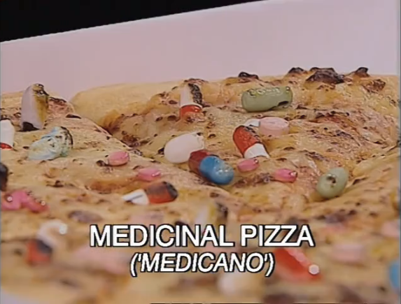

# pentobarbital

So you've decided to kill yourself!

# video: Giving Up

# video: Suic!de and Ment@l He@lth | Philosophy Tube ★

# please don't kill yourself

Please don't kill yourself because there are people who care about you even if they are hard to see, and there is always a chance things will get better, but if you do, consider first constructing an elabotate plan [like Dr. Ford did](https://www.youtube.com/watch?v=ro0H8c4mgq0).

Hey you should also check out [set_and_setting](set_and_setting.md), which features some notes on a wonderful, if rather badly written app called [Trip Buddy](https://raw.githubusercontent.com/justakissaway/dark/master/apps/appinventor.ai_joelritossa.TripeGuide.apk). It has little things in it that try to calm you and its ineptness is kinda charming.

# counterpoint: there can be emergent meaning in suffering

In the following video you can see beautiful colors. These colors would not exist if there were not millions of years of evolutionary suffering. Yet they still arose and they are beautiful.

- [Imgur_GIF-jYsxnT4.mp4](media/Imgur_GIF-jYsxnT4.mp4)

# how to actually kill yourself with dignity

- [Dignitas euthanasia video](https://vimeo.com/45117071)

The method of euthanasia used by Dignitas is ingestion of 15 g of pentobarbital powder dissolved in water.

- <https://en.wikibooks.org/wiki/Suicide/Toxification/Pentobarbital>

Pentobarbital (trade name: Nembutal, made in 1930 br Dr. John S. Lundy from the chemical formula of the sodium salt -- Na (sodium) + ethyl + methyl + butyl + al (common barbiturates suffix)) is a barbiturate class drug. It was used widely during the 1940s and 1950s as a sleeping pill. It is highly lethal in overdose. It is very reliable and brings about seemingly peaceful death, so it is one of the drugs of choice for assisted suicide. Antiemetic drugs should be taken in advance in order to prevent vomiting from occurring.

Secobarbital (Seconal) is a potentially stronger alternative to pentobarbital. It is for use only if you want to go double-dead.
