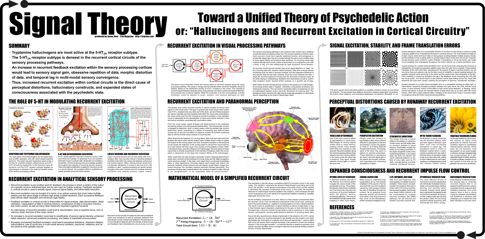

# replications

- [Effect Index](https://www.effectindex.com)

# color shifting

- [Effect Index color shifting](https://www.effectindex.com/effects/colour-shifting)

# symmetrical texture repetition

- [Effect Index symmetrical texture repetition](https://www.effectindex.com/effects/symmetrical-texture-repetition)

## floor patterns

---
<iframe width="560" height="315" src="https://www.youtube.com/embed/KfHALzDK7jQ" frameborder="0" allow="accelerometer; autoplay; encrypted-media; gyroscope; picture-in-picture" allowfullscreen></iframe>
---

# DMT replications

---
<iframe width="600" height="338" src="https://i.imgur.com/xy54YvA.gifv" frameborder="0" autoplay;></iframe>
---
<iframe width="720" height="720" src="https://i.imgur.com/xy54YvA.gifv" frameborder="0" autoplay;></iframe>
---
<iframe width="560" height="315" src="https://www.youtube.com/embed/ayzR73pRsFs" frameborder="0" allow="accelerometer; autoplay; encrypted-media; gyroscope; picture-in-picture" allowfullscreen></iframe>
---
<iframe width="560" height="315" src="https://www.youtube.com/embed/c8U4wNp3XyU" frameborder="0" allow="accelerometer; autoplay; encrypted-media; gyroscope; picture-in-picture" allowfullscreen></iframe>
