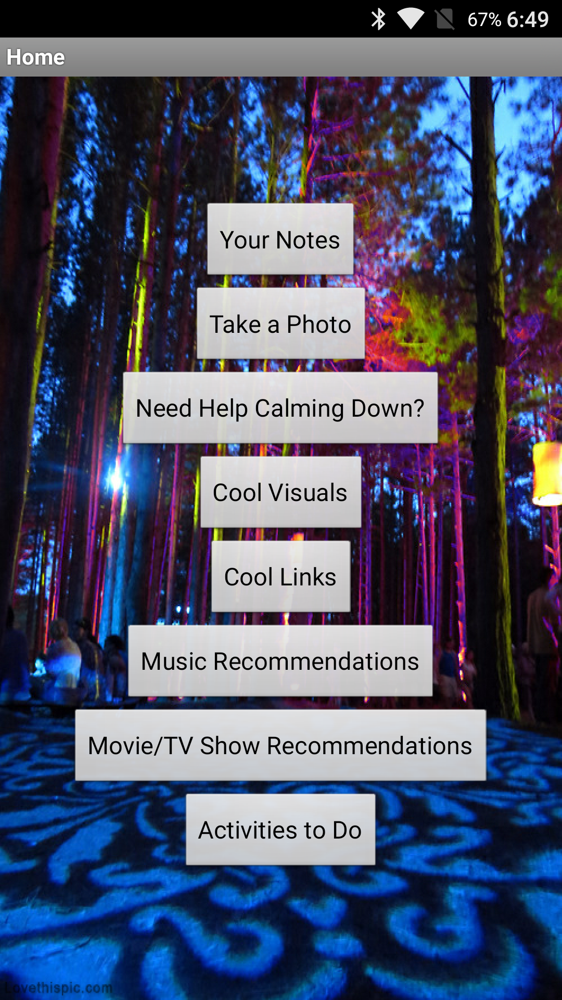

# set and setting

# calm

# checklist LSD

- keys and telephone and wallet attached securely to body
- tissue
- Xanax
- optional
    - bottle of water
    - pen and notebook
        - simple statement: "Don't panic: You are on drugs."
        - contact number and address
        - checklist of things to think about
    - video recordings
    - sound recordings
    - rain clothes/hat/umbrella
    - [Trazodone](https://www.reddit.com/r/Drugs/comments/519ysv/trazodone_and_why_it_should_be_in_every/)

# psycedelics safety

In the case of anxiety, provide strong personal support and reassurance. A solid sense of security and calm should be conveyed while empathizing with what may be an intense and unpleasant experience. Attempts to "talk down" using reality-defining techniques as a distraction may be counterproductive. Remind to surrender to the experience. Reassurance forms may include a supportive touch to the arm or shoulder with verbal reminders of being not sober and that normal consciousness will return in "a few minutes" or "a few hours" depending on the appropriate time estimate. In particularly intense experiences when verbal interactions are of limited help, a powerful form of reassurance (sometimes called "interpersonal grounding") is simply holding the hand of the participant, which appears to provide a sense of stability and connection.

For cases in which acute psychological distress is insufficiently managed with reassurance alone, treatment with a benzodiazepine anxiolytic is a pharmacological intervention of choice, e.g. 10 mg oral dose of diazepam. 

- [Human hallucinogen research: guidelines for safety](2008_johnson_7355_2.pdf)

# Trip Buddy

- [Trip Buddy APK](https://raw.githubusercontent.com/justakissaway/dark/master/apps/appinventor.ai_joelritossa.TripeGuide.apk)
    - ([old Google play Trip Buddy link](https://play.google.com/store/apps/details?id=appinventor.ai_joelritossa.TripeGuide))

